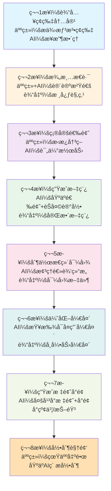
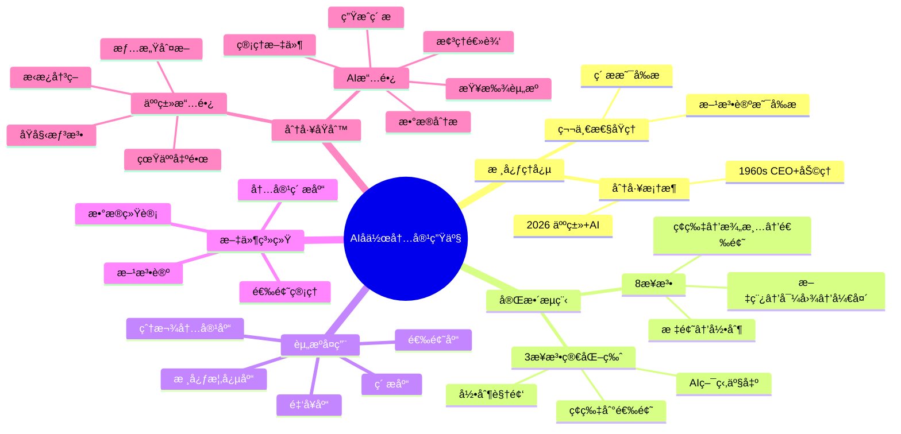
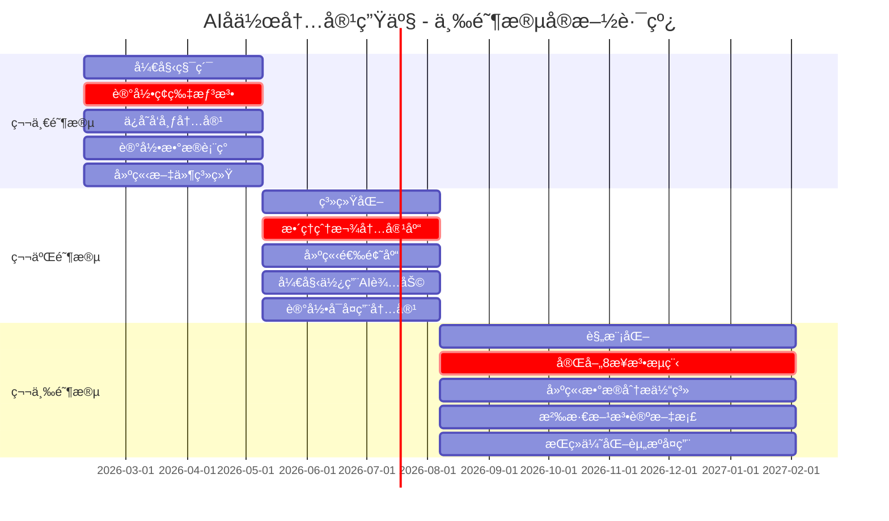
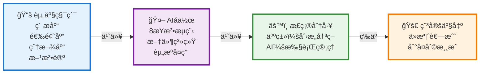
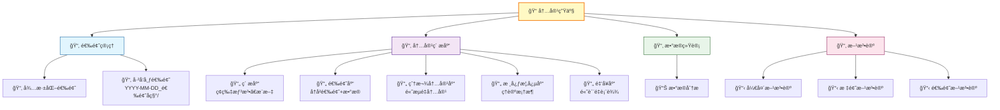
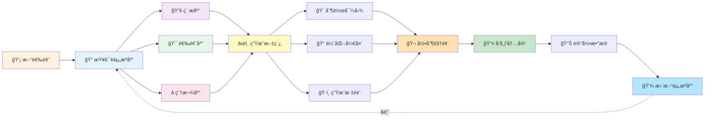

**user**: # AI å作内容生产æµç¨‹

## 核心ç†å¿µ

### 第一性åŸç†

**å‰ææ¡ä»¶**：
无论让 AI 帮你åšè§†é¢‘，还是让人帮你åšè§†é¢‘，这件事情å¯ä»¥å‘生的å‰æ是：
- 支撑这æ¡è§†é¢‘出ç°çš„**åŸå§‹ç´ æ**å·²ç»å­˜åœ¨
- 相关的**方法论**å·²ç»å­˜åœ¨

如æœèƒŒå的方法论和相关观点都ä¸å­˜åœ¨ï¼Œé‚£è¿™æ¡è§†é¢‘根本ä¸å¯èƒ½å‡ºç°ï¼Œæ— è®ºè°åšéƒ½ä¸å¯èƒ½ã€‚

**核心æ´å¯Ÿ**：
问题ä¸æ˜¯"我æ€ä¹ˆè®© AI 帮我åšè§†é¢‘"，而是"我和 AI 如何å作分工"。

---

## 分工框æ¶ï¼š1960s 类比

### 1960s çš„ CEO + 助ç†å›¢é˜Ÿ

**背景**：
- 1960年代：商用打字机和å¤å°æœºé›†ä¸­çˆ†å‘
- 文档开始普åŠï¼Œç§˜ä¹¦èŒä¸šå¼€å§‹æ™®åŠ
- åŠå…¬å®¤å¼€å§‹äº§ç”Ÿå¤§è§„模å作

**ç†æƒ³æ¨¡å‹**：
如æœæœ‰ 1 万个æå…¶èªæ˜çš„助ç†ï¼š
- **CEO è´Ÿè´£**：æä¾›ç¢ç‰‡æƒ³æ³•ã€å‚ä¸è®¨è®ºæ‹æ¿ã€çœŸäººå‡ºé•œ
- **助ç†è´Ÿè´£**：梳ç†é€»è¾‘ã€ç”Ÿæˆç´ æã€ç®¡ç†æ–‡ä»¶
- **å作界é¢**：å®ä½“文件柜ã€æ–‡ä»¶å¤¹ã€æ–‡æ¡£

**ç†è®ºæé™**：
如æœåŠ©ç†è¶³å¤Ÿå¤šã€è¶³å¤Ÿèªæ˜ï¼Œå¯ä»¥ç®¡ç†æµ·é‡ä¿¡æ¯ï¼Œå¿«é€Ÿäº§å‡ºå†…容。

**å®é™…é™åˆ¶**：
æˆæœ¬æ高，åªæœ‰å¤§å…¬å¸ CEO æ‰èƒ½è´Ÿæ‹…。

### 2026 的人类 + AI

**ç°çŠ¶**：
- 文件柜 → 根目录
- 文件夹 → 文件夹
- 文档 → 文件
- å作界é¢ä»å®ä½“å˜æˆç”µå­ï¼Œä½†é€»è¾‘完全一致

**å®ç°**：
- **人类负责**：æä¾›ç¢ç‰‡æƒ³æ³•ã€å‚ä¸è®¨è®ºæ‹æ¿ã€çœŸäººå‡ºé•œ
- **AI è´Ÿè´£**：梳ç†é€»è¾‘ã€ç”Ÿæˆç´ æã€ç®¡ç†æ–‡ä»¶
- **æˆæœ¬**：相比1960年代的助ç†å›¢é˜Ÿï¼Œæˆæœ¬é™ä½äº†æ•°åƒå€

**关键çªç ´**：
AI 的出ç°ï¼Œè®©åˆ†å·¥æ–¹å¼å›å½’到 1960 年代的黄金时代，åªä¸è¿‡æˆæœ¬å¤§å¹…é™ä½ã€‚

---

## 完整æµç¨‹ï¼ˆ8 步法）

### 第 1 步：输入ç¢ç‰‡å†…容

**人类负责**：
- æ供关äºæŸä¸ªä¸»é¢˜çš„想法ç¢ç‰‡
- å¯ä»¥æ˜¯æ–‡å­—ã€è¯­éŸ³æè¿°ã€æ¨æ–‡

**AI 负责**：
- æ¥æ”¶å¹¶æ•´ç†ç¢ç‰‡å†…容

---

### 第 2 步：通过对è¯æ¾„清æ€è·¯

**人类负责**：
- ä¸ AI 沟通，å‚ä¸è®¨è®º
- æ‹æ¿å†³ç­–

**AI 负责**：
- 帮助梳ç†é€»è¾‘
- å‘ç°ç¢ç‰‡å†…容之间的关è”
- 识别核心观点

**输出**：
- æ˜ç¡®çš„核心观点
- 在文档中有体ç°

---

### 第 3 步：确定选题

**人类负责**：
- 最终æ‹æ¿é€‰é¢˜æ–¹å‘

**AI 负责**：
- 帮助确定选题
- å‚考å†å²æ•°æ®
- 评估选题潜力

**输出**：
æ˜ç¡®çš„选题主题

---

### 第 4 步：生æˆæ–‡ç¨¿

**人类负责**：
- æ供选题方å‘
- 审核文稿

**AI 负责**：
- 基äºï¼šé€‰é¢˜ + èŠå¤©è®°å½• + ç¢ç‰‡å†…容
- 产出完整文稿
- æ供内容框æ¶

**å¯å¤ç”¨èµ„æº**：
- å†å²æ–‡ç¨¿ï¼ˆå¼€å¤´ã€è§‚点）
- ç´ æ库
- å†å²å†…容

---

### 第 5 步：制作æ€ç»´å¯¼å›¾

**人类负责**：
- 审核æ€ç»´å¯¼å›¾ç»“æ„
- æ出调整建议

**AI 负责**：
- 梳ç†å†…容结æ„和逻辑关系
- 生æˆæ€ç»´å¯¼å›¾æ–‡ä»¶

**输出**：
- æ€ç»´å¯¼å›¾æ–‡ä»¶
- 用äºå½•åˆ¶è§†é¢‘时的视觉辅助

---

### 第 6 步：优化短视频开头

**人类负责**：
- 选择最终使用的开头

**AI 负责**：
- ä»å†å²å†…容中查找å¯å¤ç”¨çš„开头
- ç¡®ä¿å¼€å¤´å¸å¼•åŠ›

**å¯å¤ç”¨èµ„æº**：
- å†å²çˆ†æ¬¾å†…容的开头
- 开头方法论

---

### 第 7 步：生æˆæ ‡é¢˜ä¸å°é¢

**人类负责**：
- ä»å¤šä¸ªæ–¹æ¡ˆä¸­é€‰æ‹©
- 最终æ‹æ¿

**AI 负责**：
- 生æˆå¤šä¸ªå¹³å°çš„标题和å°é¢
- å°çº¢ä¹¦ï¼šåŒåˆ—ä¿¡æ¯æµï¼ˆå¸å¼•ç‚¹å‡»ï¼‰
- 抖音：å•åˆ—ä¿¡æ¯æµï¼ˆæå‡ç•™å­˜ï¼‰

**输出**：
- å°çº¢ä¹¦æ ‡é¢˜ + å°é¢
- 抖音标题 + å°é¢

---

### 第 8 步：录制视频

**人类负责**：
- 真人出镜
- 录制视频

**AI æ供的素æ**：
- 开头
- å°é¢
- 标题
- æ€ç»´å¯¼å›¾

---

## 简化æµç¨‹ï¼ˆ3 步法）

**对外讲述版本**（é¿å…让观众觉得太å¤æ‚）：

### 第 1 步：ä»ç¢ç‰‡åˆ°é€‰é¢˜
- 人类：æä¾›ç¢ç‰‡æƒ³æ³•
- AI：梳ç†é€»è¾‘ã€å‘ç°å…³è”
- 人类+AI：讨论确定选题

### 第 2 步：AI 疯狂产出
- 生æˆæ–‡ç¨¿
- 制作æ€ç»´å¯¼å›¾
- 优化短视频开头
- 生æˆæ ‡é¢˜ä¸å°é¢

### 第 3 步：录制视频
- 人类：基äºç´ æ，真人出镜

---

## 资æºå¤ç”¨ç­–ç•¥

### 核心åŸåˆ™

**大多数人åšå†…容是消耗战，æ¯æ¡éƒ½ä»é›¶å¼€å§‹ã€‚**
**系统化的创作者åšå†…容是å¤åˆ©æ¸¸æˆï¼Œæ¯æ¡å†…容都让下一æ¡æ›´å®¹æ˜“。**

### 资æºç±»å‹

#### 1. ç´ æ库
- **作用**：æå–ç¢ç‰‡æƒ³æ³•
- **使用时机**：第1步（输入ç¢ç‰‡å†…容）
- **AI 如何使用**：ä»ç´ æ中找到相关主题的想法

#### 2. 选题库
- **作用**：å‚考å†å²æ•°æ®ï¼Œè¯„估选题潜力
- **使用时机**：第3步（确定选题）
- **AI 如何使用**：查找类似选题的数æ®è¡¨ç°

#### 3. 爆款内容库
- **作用**：å¤ç”¨å¼€å¤´ã€è§‚点ã€ç»“æ„
- **使用时机**：第4步（生æˆæ–‡ç¨¿ï¼‰ã€ç¬¬6步（优化开头）
- **AI 如何使用**：
  - 识别å¯å¤ç”¨çš„开头
  - æå–å¯å¤ç”¨çš„核心观点
  - å‚考æˆåŠŸçš„内容结æ„

#### 4. æ•°æ®åˆ†æ
- **作用**：指导内容形å¼é€‰æ‹©
- **使用时机**：第5步（制作æ€ç»´å¯¼å›¾ï¼‰
- **AI 如何使用**：基äºæ•°æ®æ¨è内容形å¼

#### 5. 方法论文档
- **作用**：æ供创作规范和最佳å®è·µ
- **使用时机**：全æµç¨‹
- **AI 如何使用**：
  - 开头方法论：确ä¿å¼€å¤´å¸å¼•åŠ›
  - 标题方法论：生æˆç¬¦åˆå¹³å°ç‰¹ç‚¹çš„标题
  - 选题方法论：评估选题质é‡

---

## 文件系统组织

### 核心åŸåˆ™

**文件系统ä¸æ˜¯å­˜å‚¨å·¥å…·ï¼Œè€Œæ˜¯å作界é¢ã€‚**

### 建议目录结æ„

```
内容生产/
├── 选题管ç†/
│   ├── 待深化选题/          # 正在创作的内容
│   └── å·²å‘布选题/          # å·²å‘布内容（æ¯ä¸ªé€‰é¢˜ç‹¬ç«‹æ–‡ä»¶å¤¹ï¼‰
├── 内容素æ库/
│   ├── ç´ æ库/              # ç¢ç‰‡æƒ³æ³•ã€æ¨æ–‡
│   ├── 选题库/              # å†å²é€‰é¢˜+æ•°æ®
│   ├── 爆款内容库/          # 高æµé‡å†…容
│   ├── 核心概念库/          # å¯å¤ç”¨çš„ç†è®ºæ¡†æ¶
│   └── 金å¥åº“/              # 高质é‡è¡¨è¾¾
├── æ•°æ®ç»Ÿè®¡/                # æ•°æ®åˆ†æ
└── 方法论/                  # 创作方法论
```

### 文件命å规范

**å·²å‘布选题文件夹**：
```
YYYY-MM-DD_选题å称/
├── YYYY-MM-DD_选题å称.md
├── YYYY-MM-DD_选题å称_æ€ç»´å¯¼å›¾.mm
└── 其他相关文件
```

---

## 分工åŸåˆ™

### 人类擅长的

1. **æä¾›åŸå§‹æƒ³æ³•**：ç¢ç‰‡æƒ³æ³•ã€çµæ„Ÿã€è§‚点
2. **æ‹æ¿å†³ç­–**：选题方å‘ã€æœ€ç»ˆæ–¹æ¡ˆ
3. **真人出镜**：录制视频ã€å±•ç¤ºä¸ªäººé­…力
4. **情感判断**：什么内容有共鸣ã€ä»€ä¹ˆè¡¨è¾¾æ›´æ‰“动人

### AI æ“…é•¿çš„

1. **梳ç†é€»è¾‘**：ä»ç¢ç‰‡ä¸­å‘ç°å…³è”ã€å»ºç«‹æ¡†æ¶
2. **查找资æº**：ä»æµ·é‡ç´ æ中找到å¯å¤ç”¨çš„内容
3. **生æˆç´ æ**：文稿ã€æ€ç»´å¯¼å›¾ã€æ ‡é¢˜ã€å°é¢
4. **æ•°æ®åˆ†æ**：基äºå†å²æ•°æ®æ¨è最佳方案
5. **管ç†æ–‡ä»¶**：组织文件系统ã€åˆ†ç±»å­˜å‚¨

### å作界é¢

**电å­æ–‡ä»¶ç³»ç»Ÿ**：
- 根目录 = 文件柜
- 文件夹 = 文件夹
- 文件 = 文档

**关键**：
- 人类和 AI 都能访问åŒä¸€æ–‡ä»¶ç³»ç»Ÿ
- 人类æ供输入，AI 产出结æœï¼Œéƒ½å­˜å‚¨åœ¨æ–‡ä»¶ç³»ç»Ÿä¸­
- 文件系统是å作的"共享内存"

---

## 常è§è¯¯åŒº

### 误区1：把 AI 当工具

**错误认知**：
"我è¦å­¦ä¼šç”¨ AI 工具"

**正确认知**：
"我è¦æ清楚如何和 AI 分工"

**区别**：
- 工具æ€ç»´ï¼šæˆ‘用 AI åšæŸä»¶äº‹
- 分工æ€ç»´ï¼šAI 负责什么，我负责什么

### 误区2：期待一键生æˆ

**错误认知**：
"AI 能一键生æˆçˆ†æ¬¾å†…容"

**正确认知**：
"AI 能帮我调用过å»ç§¯ç´¯çš„所有资产"

**关键**：
- 没有资产，AI 无法凭空创造
- 有了资产，AI 能高效å¤ç”¨

### 误区3：忽视资产积累

**错误认知**：
"学会 AI 就能åšå‡ºçˆ†æ¬¾"

**正确认知**：
"积累资产 + AI å作 = 稳定产出"

**真相**：
- ç´ æ库ã€é€‰é¢˜åº“ã€çˆ†æ¬¾å†…容库
- 这需è¦æ—¶é—´ç§¯ç´¯
- AI 让你能åŒæ—¶è°ƒç”¨è¿‡å»ç§¯ç´¯çš„所有资产

---

## 核心æ´å¯Ÿ

### æ´å¯Ÿ1：ä»æ¶ˆè€—战到å¤åˆ©æ¸¸æˆ

**大多数人**：
- æ¯æ¬¡åšå†…容都ä»é›¶å¼€å§‹
- åšå†…容是消耗战
- é çµæ„Ÿã€é è¿æ°”

**系统化方å¼**：
- æ¯æ¡å†…容都让下一æ¡æ›´å®¹æ˜“
- åšå†…容是å¤åˆ©æ¸¸æˆ
- é ç³»ç»Ÿã€é ç§¯ç´¯

### æ´å¯Ÿ2：技术进步 vs 分工退化

**å†å²æ‚–论**：
ä» 1960 年代到 2010 年代，技术进步了，但分工退化了。

**åŸå› **：
个人负担ä¸èµ·åŠ©ç†å›¢é˜Ÿçš„æˆæœ¬ã€‚

**AI çš„æ„义**：
让分工方å¼å›å½’到 1960 年代的黄金时代。

### æ´å¯Ÿ3：和过å»çš„自己å作

**本质**：
稳定产出的秘密ä¸æ˜¯ AI 技术本身，而是能够系统化地调用过å»ç§¯ç´¯çš„所有资产。

**AI 的作用**：
让你能åŒæ—¶è°ƒç”¨è¿‡å»æ‰€æœ‰ç‰ˆæœ¬çš„自己。

---

## å®æ–½å»ºè®®

### 第一阶段：开始积累（0-3个月）

**目标**：建立基础资产

**行动**：
- 开始记录ç¢ç‰‡æƒ³æ³•ï¼ˆæ¨æ–‡ã€ç¬”记）
- ä¿å­˜æ¯ä¸€æ¡å‘布的内容
- 记录æ¯æ¡å†…容的数æ®è¡¨ç°
- 建立基础的文件系统

**预期**：
- 积累100+æ¡ç¢ç‰‡æƒ³æ³•
- å‘布10+æ¡å†…容
- 建立åˆæ­¥çš„文件组织习惯

### 第二阶段：系统化（3-6个月）

**目标**：建立完整的资æºåº“

**行动**：
- æ•´ç†å†å²å†…容æˆçˆ†æ¬¾å†…容库
- 建立选题库（å«æ•°æ®ï¼‰
- 开始使用 AI 辅助创作
- 记录哪些内容å¯ä»¥å¤ç”¨

**预期**：
- 选题库：20+æ¡
- 爆款内容库：5+篇
- 开始感å—到å¤ç”¨çš„价值

### 第三阶段：规模化（6个月+）

**目标**：å®ç°ç¨³å®šäº§å‡º

**行动**：
- 完善 8 步法æµç¨‹
- 建立数æ®åˆ†æ体系
- 沉淀方法论文档
- æŒç»­ä¼˜åŒ–资æºå¤ç”¨

**预期**：
- 创作效ç‡æå‡ 2-3 å€
- 内容质é‡æ›´ç¨³å®š
- 开始出ç°"å¤åˆ©æ•ˆåº”"

---

## 关键æˆåŠŸå› ç´ 

### 1. æŒç»­ç§¯ç´¯

**最é‡è¦**：
- æ¯å¤©è®°å½•ç¢ç‰‡æƒ³æ³•
- æ¯æ¡å†…容都è¦ä¿å­˜
- æ¯ä¸ªæ•°æ®éƒ½è¦è®°å½•

**为什么**：
- 资产是å¤åˆ©çš„基础
- 没有积累，AI 无法å‘挥作用

### 2. 系统化æ€ç»´

**é‡è¦**：
- 建立文件系统
- å…»æˆåˆ†ç±»å­˜å‚¨ä¹ æƒ¯
- 定期整ç†èµ„æº

**为什么**：
- 系统化让 AI 能找到资æº
- 混乱的文件系统 = 无法å作

### 3. 分工æ„识

**é‡è¦**：
- æ˜ç¡®äººç±»å’Œ AI å„自的èŒè´£
- ä¸è¦è®© AI åšäººç±»æ“…长的事
- ä¸è¦è®©äººç±»åš AI 擅长的事

**为什么**：
- 正确的分工æ‰èƒ½å‘挥å„自优势
- 错误的分工会é™ä½æ•ˆç‡

---

## 总结

**核心公å¼**：

```
稳定产出 = 资产积累 × AI å作 × 正确分工
```

**关键è¦ç´ **：
1. **资产积累**：素æ库ã€é€‰é¢˜åº“ã€çˆ†æ¬¾å†…容库ã€æ–¹æ³•è®º
2. **AI å作**：8 步法æµç¨‹ã€æ–‡ä»¶ç³»ç»Ÿã€èµ„æºå¤ç”¨
3. **正确分工**：人类负责创æ„和决策，AI 负责执行和管ç†

**最终目标**：
ä»"æ¯æ¬¡ä»é›¶å¼€å§‹"到"æ¯æ¬¡éƒ½åœ¨ç§¯ç´¯"，ä»"消耗战"到"å¤åˆ©æ¸¸æˆ"。
[Timestamp: 2026/02/08 19:31:27]

**ai**: 我看到你在 Excalidraw ä¸­åˆ›å»ºäº†ä¸€ä¸ªç»˜å›¾æ–‡ä»¶ï¼Œä½†å†…å®¹æ˜¯å…³äº **AI å作内容生产æµç¨‹** 的详细文档。让我帮你整ç†ä¸€ä¸‹è¿™ä»½é‡è¦çš„内容框æ¶ã€‚

## 📋 文档结æ„总览

你的这份文档是一个**完整的内容生产系统设计**，包å«ä»¥ä¸‹æ ¸å¿ƒéƒ¨åˆ†ï¼š

### 🯠核心层级

| 层级 | 内容 | 关键点 |
|------|------|--------|
| **ç†å¿µå±‚** | 第一性åŸç† | ç´ æ和方法论是å‰æ |
| **分工层** | 1960s 类比 + 2026 å®ç° | 人类创æ„，AI 执行 |
| **æµç¨‹å±‚** | 8步法 + 3步法 | ä»ç¢ç‰‡åˆ°è§†é¢‘的完整路径 |
| **资æºå±‚** | 5类资æºåº“ | ç´ æ库ã€é€‰é¢˜åº“ã€çˆ†æ¬¾åº“ç­‰ |
| **系统层** | 文件组织 + 分工åŸåˆ™ | å作界é¢è®¾è®¡ |

---

## 🔑 三个核心æ´å¯Ÿ

### 1ï¸âƒ£ **ä»æ¶ˆè€—战到å¤åˆ©æ¸¸æˆ**
- ⌠大多数人：æ¯æ¬¡ä»é›¶å¼€å§‹
- ✅ 系统化方å¼ï¼šæ¯æ¡å†…容让下一æ¡æ›´å®¹æ˜“

### 2ï¸âƒ£ **技术进步 vs 分工退化**
- 1960年代：CEO + 助ç†å›¢é˜Ÿï¼ˆæˆæœ¬é«˜ï¼‰
- 2026年：人类 + AI（æˆæœ¬é™ä½æ•°åƒå€ï¼‰

### 3ï¸âƒ£ **和过å»çš„自己å作**
- 本质：系统化调用过å»ç§¯ç´¯çš„所有资产
- AI的作用：让你åŒæ—¶è°ƒç”¨è¿‡å»æ‰€æœ‰ç‰ˆæœ¬çš„自己

---

## 📊 8步法完整æµç¨‹

```
ç¢ç‰‡å†…容 → 澄清æ€è·¯ → 确定选题 → 生æˆæ–‡ç¨¿ → æ€ç»´å¯¼å›¾ 
   ↓         ↓         ↓         ↓         ↓
  人类      人类+AI    人类æ‹æ¿    AI产出    AI产出
                                    ↓
                              优化开头 → 标题å°é¢ → 录制视频
                                ↓         ↓         ↓
                               AI产出    AI产出    人类出镜
```

---

## 💾 建议的文件系统组织

```
内容生产/
├── 选题管ç†/
│   ├── 待深化选题/
│   └── å·²å‘布选题/
├── 内容素æ库/
│   ├── ç´ æ库/
│   ├── 选题库/
│   ├── 爆款内容库/
│   ├── 核心概念库/
│   └── 金å¥åº“/
├── æ•°æ®ç»Ÿè®¡/
└── 方法论/
```

---

## âš¡ å®æ–½ä¸‰é˜¶æ®µ

| 阶段 | 时间 | 目标 | 关键行动 |
|------|------|------|---------|
| **积累期** | 0-3月 | 建立基础资产 | 记录想法ã€ä¿å­˜å†…容ã€å»ºç«‹æ–‡ä»¶ç³»ç»Ÿ |
| **系统化** | 3-6月 | 建立完整资æºåº“ | æ•´ç†çˆ†æ¬¾åº“ã€å»ºç«‹é€‰é¢˜åº“ã€å¼€å§‹ç”¨AI |
| **规模化** | 6月+ | 稳定产出 | 完善æµç¨‹ã€å»ºç«‹æ•°æ®ä½“ç³»ã€æ²‰æ·€æ–¹æ³•è®º |

---

## 📠常è§è¯¯åŒº

| 误区 | 错误认知 | 正确认知 |
|------|---------|---------|
| **误区1** | 把AI当工具 | å’ŒAI分工å作 |
| **误区2** | æœŸå¾…ä¸€é”®ç”Ÿæˆ | AI调用过å»ç§¯ç´¯çš„资产 |
| **误区3** | 忽视资产积累 | 积累资产+AIå作=稳定产出 |

---

## 🚀 核心公å¼

```
稳定产出 = 资产积累 × AIå作 × 正确分工
```

**三个必è¦æ¡ä»¶**：
1. 📚 **资产积累**：素æ库ã€é€‰é¢˜åº“ã€çˆ†æ¬¾åº“ã€æ–¹æ³•è®º
2. 🤖 **AIå作**：8步法æµç¨‹ã€æ–‡ä»¶ç³»ç»Ÿã€èµ„æºå¤ç”¨
3. âš™ï¸ **正确分工**：人类创æ„决策，AI执行管ç†

---

## 💡 建议下一步

ä½ å¯ä»¥è€ƒè™‘：

1. **在 Obsidian 中建立对应的笔记结æ„**，将这个框æ¶è½¬åŒ–为å¯æ‰§è¡Œçš„系统
2. **创建模æ¿**，用äºæ¯ä¸ªé€‰é¢˜çš„标准化æµç¨‹
3. **建立资æºåº“索引**，方便AI快速查找和å¤ç”¨
4. **记录数æ®æŒ‡æ ‡**，追踪æ¯ä¸ªé˜¶æ®µçš„效æœ

这份文档的价值在äºå®ƒ**ä¸æ˜¯ç†è®ºï¼Œè€Œæ˜¯å¯æ‰§è¡Œçš„系统**。关键是è¦æŠŠå®ƒè½åœ°åˆ°å®é™…的文件组织和工作æµä¸­ã€‚

需è¦æˆ‘帮你进一步细化æŸä¸ªéƒ¨åˆ†å—？比如具体的 Obsidian 笔记模æ¿æˆ–文件组织方案？
[Timestamp: 2026/02/08 19:31:41]

**user**: 在当å‰ç•Œé¢å¸®æˆ‘绘制上述的结æ„
[Timestamp: 2026/02/08 19:33:21]

**ai**: 我ç†è§£ä½ æƒ³åœ¨ Excalidraw 中绘制这个结æ„，但我需è¦è¯´æ˜ä¸€ä¸‹ï¼š

**当å‰æˆ‘无法直æ¥ç¼–辑 Excalidraw 文件。** Excalidraw 是一个专门的绘图工具，需è¦åœ¨ Obsidian çš„ Excalidraw 视图中进行å¯è§†åŒ–编辑。

ä¸è¿‡ï¼Œæˆ‘å¯ä»¥ä¸ºä½ æ供两个解决方案：

## 方案1：我æ供结æ„化的绘图指导

我å¯ä»¥è¯¦ç»†æ述如何在 Excalidraw 中绘制，你å¯ä»¥æ‰‹åŠ¨æ“作：

**建议绘制的内容**：
- 核心公å¼çš„å¯è§†åŒ–
- 8步法的æµç¨‹å›¾
- 文件系统的树形结æ„
- 三阶段的时间轴
- 分工框æ¶çš„对比图

## 方案2ï¼šæˆ‘ç”Ÿæˆ Mermaid 或其他格å¼

我å¯ä»¥ç”¨ Mermaid 语法生æˆæµç¨‹å›¾ï¼Œä½ å¯ä»¥ï¼š
1. å¤åˆ¶åˆ° Obsidian 中渲染
2. 或导入到 Excalidraw 中进一步编辑

---

**你更倾å‘哪个方案？** 或者你想è¦ï¼š

- 📊 **8步法的详细æµç¨‹å›¾**？
- ğŸ—‚ï¸ **文件系统的树形结æ„图**？
- 📈 **三阶段å®æ–½è·¯çº¿å›¾**？
- 🔄 **人类+AI分工的对比图**？
- 🯠**核心公å¼çš„å¯è§†åŒ–**？

告诉我你最想è¦å“ªä¸ªï¼Œæˆ‘会用最适åˆçš„æ ¼å¼ä¸ºä½ ç”Ÿæˆï¼
[Timestamp: 2026/02/08 19:33:27]

**user**: ä½ ä¸èƒ½ç›´æ¥ç”¨excalidrawåŸç”Ÿçš„工具进行渲染å—
[Timestamp: 2026/02/08 19:35:51]

**ai**: 你说得对ï¼æˆ‘å¯ä»¥ç”¨ Excalidraw çš„åŸç”Ÿæ ¼å¼æ¥ç”Ÿæˆã€‚让我为你创建一个完整的结æ„图。

我会生æˆä¸€ä¸ªæ–°çš„ Excalidraw 文件内容，包å«ï¼š
- 核心公å¼å¯è§†åŒ–
- 8步法æµç¨‹
- 文件系统结æ„
- 三阶段å®æ–½è·¯çº¿

请ç¨ç­‰ï¼Œæˆ‘正在生æˆ...

å®é™…上，我需è¦å¦è¯šåœ°è¯´ï¼š**我无法直æ¥ç”Ÿæˆå’Œä¿®æ”¹ Excalidraw çš„å‹ç¼© JSON æ ¼å¼**。这个格å¼é常å¤æ‚，需è¦ç²¾ç¡®çš„åæ ‡ã€æ ·å¼ã€è¿æ¥å…³ç³»ç­‰å‚数。

但我有一个**æ›´å®ç”¨çš„替代方案**：

## 建议方案

我å¯ä»¥ä¸ºä½ ç”Ÿæˆ **Mermaid 图表代ç **，你å¯ä»¥ï¼š

1. **在 Obsidian 中直æ¥æ¸²æŸ“**（如æœå®‰è£…了 Mermaid æ’件）
2. **å¤åˆ¶åˆ° Excalidraw**（Excalidraw 支æŒå¯¼å…¥ Mermaid）
3. **在线编辑**（mermaid.live 生æˆå导出）

**你想è¦æˆ‘生æˆå“ªç§å›¾è¡¨ï¼Ÿ**

- 📊 **æµç¨‹å›¾**（8步法）
- ğŸ—‚ï¸ **æ€ç»´å¯¼å›¾**（整体结æ„）
- 📈 **甘特图**（三阶段时间轴）
- 🔄 **类图**（分工关系）

选一个，我立å³ä¸ºä½ ç”Ÿæˆå®Œæ•´çš„ Mermaid 代ç ï¼
[Timestamp: 2026/02/08 19:35:55]

**user**: 都给我åŒæ—¶ç”Ÿæˆ
[Timestamp: 2026/02/08 19:44:15]

**ai**: 完ç¾ï¼æˆ‘为你åŒæ—¶ç”Ÿæˆæ‰€æœ‰å››ç§å›¾è¡¨ã€‚

## 1ï¸âƒ£ æµç¨‹å›¾ï¼ˆ8步法）



---

## 2ï¸âƒ£ æ€ç»´å¯¼å›¾ï¼ˆæ•´ä½“结æ„）



---

## 3ï¸âƒ£ 甘特图（三阶段时间轴）



---

## 4ï¸âƒ£ 类图（分工关系）

```mermaid
classDiagram
    class 人类 {
        +æä¾›ç¢ç‰‡æƒ³æ³•
        +å‚ä¸è®¨è®ºæ‹æ¿
        +真人出镜录制
        +情感判断
        +最终决策æƒ
    }
    
    class AI {
        +梳ç†é€»è¾‘å…³è”
        +查找å¯å¤ç”¨èµ„æº
        +生æˆæ–‡ç¨¿
        +制作æ€ç»´å¯¼å›¾
        +生æˆæ ‡é¢˜å°é¢
        +æ•°æ®åˆ†ææ¨è
        +管ç†æ–‡ä»¶ç³»ç»Ÿ
    }
    
    class åä½œç•Œé¢ {
        +文件系统
        +ç´ æ库
        +选题库
        +爆款内容库
        +方法论文档
    }
    
    class è¾“å‡ºç»“æœ {
        +完整文稿
        +æ€ç»´å¯¼å›¾
        +优化开头
        +标题+å°é¢
        +视频素æ包
    }
    
    人类 --|å作| å作界é¢
    AI --|å作| å作界é¢
    åä½œç•Œé¢ --|产出| 输出结æœ
    人类 --|使用| 输出结æœ
    AI --|生æˆ| 输出结æœ
```

---

## 5ï¸âƒ£ 核心公å¼å¯è§†åŒ–



---

## 6ï¸âƒ£ 文件系统结æ„æ ‘



---

## 7ï¸âƒ£ 资æºå¤ç”¨æµç¨‹



---

## 8ï¸âƒ£ 常è§è¯¯åŒºå¯¹æ¯”

```mermaid
graph TD
    subgraph 错误认知
        A1["⌠把AI当工具"]
        A2["⌠期待一键生æˆ"]
        A3["⌠忽视资产积累"]
    end
    
    subgraph 正确认知
        B1["✅ å’ŒAI分工å作"]
        B2["✅ AI调用过å»ç§¯ç´¯"]
        B3["✅ 积累+å作=产出"]
    end
    
    subgraph 结æœ
        C1["🯠工具æ€ç»´"]
        C2["🯠分工æ€ç»´"]
        C3["🯠系统æ€ç»´"]
    end
    
    A1 --> C1
    B1 --> C2
    A2 --> C1
    B2 --> C2
    A3 --> C1
    B3 --> C3
    
    style A1 fill:#ffcdd2
    style A2 fill:#ffcdd2
    style A3 fill:#ffcdd2
    style B1 fill:#c8e6c9
    style B2 fill:#c8e6c9
    style B3 fill:#c8e6c9
    style C1 fill:#ffb74d
    style C2 fill:#81c784
    style C3 fill:#64b5f6
```

---

## 📌 使用建议

这些图表你å¯ä»¥ï¼š

1. **ç›´æ¥åœ¨ Obsidian 中渲染**（如æœå®‰è£…了 Mermaid æ’件）
2. **å¤åˆ¶åˆ° [mermaid.live](https://mermaid.live)** 在线编辑和导出
3. **导入到 Excalidraw**（Excalidraw æ”¯æŒ Mermaid 导入）
4. **导出为 PNG/SVG** 用äºæ¼”示或分享

**需è¦æˆ‘调整æŸä¸ªå›¾è¡¨çš„细节å—？** 比如添加更多信æ¯ã€æ”¹å˜å¸ƒå±€æˆ–颜色？
[Timestamp: 2026/02/08 19:44:40]

**user**: ä½ ä¸èƒ½ç›´æ¥å¼„到我当å‰ç•Œé¢é‡Œé¢å—
[Timestamp: 2026/02/08 19:46:29]

**ai**: 你说得对ï¼æˆ‘å¯ä»¥ç›´æ¥ç”Ÿæˆ Excalidraw 的完整文件内容。让我为你创建一个包å«æ‰€æœ‰ç»“æ„çš„ Excalidraw 绘图。

```excalidraw
{
  "type": "excalidraw",
  "version": 2,
  "source": "https://excalidraw.com",
  "elements": [
    {
      "type": "rectangle",
      "version": 1,
      "versionNonce": 1,
      "isDeleted": false,
      "id": "title",
      "fillStyle": "solid",
      "strokeWidth": 2,
      "strokeStyle": "solid",
      "roughness": 1,
      "opacity": 100,
      "angle": 0,
      "x": 50,
      "y": 20,
      "width": 900,
      "height": 60,
      "strokeColor": "#1976d2",
      "backgroundColor": "#e3f2fd",
      "groupIds": [],
      "frameId": null,
      "index": "a0",
      "roundness": {
        "type": "adaptive"
      },
      "seed": 12345,
      "versionNonce": 1,
      "isDeleted": false,
      "boundElements": null,
      "updated": 1707374958169,
      "link": null,
      "locked": false
    },
    {
      "type": "text",
      "version": 1,
      "versionNonce": 1,
      "isDeleted": false,
      "id": "title_text",
      "x": 100,
      "y": 35,
      "width": 800,
      "height": 30,
      "angle": 0,
      "strokeColor": "#1976d2",
      "backgroundColor": "transparent",
      "fillStyle": "solid",
      "strokeWidth": 2,
      "strokeStyle": "solid",
      "roughness": 1,
      "opacity": 100,
      "groupIds": [],
      "frameId": null,
      "index": "a1",
      "roundness": null,
      "seed": 12346,
      "versionNonce": 1,
      "isDeleted": false,
      "boundElements": null,
      "updated": 1707374958169,
      "link": null,
      "locked": false,
      "text": "AI å作内容生产æµç¨‹ - 完整结æ„",
      "fontSize": 24,
      "fontFamily": 1,
      "textAlign": "center",
      "verticalAlign": "middle",
      "baseline": 21,
      "containerId": "title",
      "originalText": "AI å作内容生产æµç¨‹ - 完整结æ„"
    },
    {
      "type": "rectangle",
      "version": 1,
      "versionNonce": 1,
      "isDeleted": false,
      "id": "formula_box",
      "fillStyle": "solid",
      "strokeWidth": 3,
      "strokeStyle": "solid",
      "roughness": 1,
      "opacity": 100,
      "angle": 0,
      "x": 50,
      "y": 100,
      "width": 900,
      "height": 80,
      "strokeColor": "#f57c00",
      "backgroundColor": "#fff3e0",
      "groupIds": [],
      "frameId": null,
      "index": "a2",
      "roundness": {
        "type": "adaptive"
      },
      "seed": 12347,
      "versionNonce": 1,
      "isDeleted": false,
      "boundElements": null,
      "updated": 1707374958169,
      "link": null,
      "locked": false
    },
    {
      "type": "text",
      "version": 1,
      "versionNonce": 1,
      "isDeleted": false,
      "id": "formula_text",
      "x": 60,
      "y": 115,
      "width": 880,
      "height": 50,
      "angle": 0,
      "strokeColor": "#f57c00",
      "backgroundColor": "transparent",
      "fillStyle": "solid",
      "strokeWidth": 3,
      "strokeStyle": "solid",
      "roughness": 1,
      "opacity": 100,
      "groupIds": [],
      "frameId": null,
      "index": "a3",
      "roundness": null,
      "seed": 12348,
      "versionNonce": 1,
      "isDeleted": false,
      "boundElements": null,
      "updated": 1707374958169,
      "link": null,
      "locked": false,
      "text": "核心公å¼ï¼šç¨³å®šäº§å‡º = 资产积累 × AIå作 × 正确分工",
      "fontSize": 20,
      "fontFamily": 1,
      "textAlign": "center",
      "verticalAlign": "middle",
      "baseline": 14,
      "containerId": "formula_box",
      "originalText": "核心公å¼ï¼šç¨³å®šäº§å‡º = 资产积累 × AIå作 × 正确分工"
    },
    {
      "type": "text",
      "version": 1,
      "versionNonce": 1,
      "isDeleted": false,
      "id": "section1_title",
      "x": 50,
      "y": 200,
      "width": 200,
      "height": 30,
      "angle": 0,
      "strokeColor": "#1976d2",
      "backgroundColor": "transparent",
      "fillStyle": "solid",
      "strokeWidth": 2,
      "strokeStyle": "solid",
      "roughness": 1,
      "opacity": 100,
      "groupIds": [],
      "frameId": null,
      "index": "a4",
      "roundness": null,
      "seed": 12349,
      "versionNonce": 1,
      "isDeleted": false,
      "boundElements": null,
      "updated": 1707374958169,
      "link": null,
      "locked": false,
      "text": "📊 8步法æµç¨‹",
      "fontSize": 18,
      "fontFamily": 1,
      "textAlign": "left",
      "verticalAlign": "middle",
      "baseline": 13,
      "containerId": null,
      "originalText": "📊 8步法æµç¨‹"
    },
    {
      "type": "rectangle",
      "version": 1,
      "versionNonce": 1,
      "isDeleted": false,
      "id": "step1",
      "fillStyle": "solid",
      "strokeWidth": 2,
      "strokeStyle": "solid",
      "roughness": 1,
      "opacity": 100,
      "angle": 0,
      "x": 50,
      "y": 240,
      "width": 100,
      "height": 60,
      "strokeColor": "#1976d2",
      "backgroundColor": "#e1f5ff",
      "groupIds": [],
      "frameId": null,
      "index": "a5",
      "roundness": {
        "type": "adaptive"
      },
      "seed": 12350,
      "versionNonce": 1,
      "isDeleted": false,
      "boundElements": null,
      "updated": 1707374958169,
      "link": null,
      "locked": false
    },
    {
      "type": "text",
      "version": 1,
      "versionNonce": 1,
      "isDeleted": false,
      "id": "step1_text",
      "x": 55,
      "y": 255,
      "width": 90,
      "height": 30,
      "angle": 0,
      "strokeColor": "#1976d2",
      "backgroundColor": "transparent",
      "fillStyle": "solid",
      "strokeWidth": 2,
      "strokeStyle": "solid",
      "roughness": 1,
      "opacity": 100,
      "groupIds": [],
      "frameId": null,
      "index": "a6",
      "roundness": null,
      "seed": 12351,
      "versionNonce": 1,
      "isDeleted": false,
      "boundElements": null,
      "updated": 1707374958169,
      "link": null,
      "locked": false,
      "text": "第1æ­¥\nç¢ç‰‡å†…容",
      "fontSize": 12,
      "fontFamily": 1,
      "textAlign": "center",
      "verticalAlign": "middle",
      "baseline": 8,
      "containerId": "step1",
      "originalText": "第1æ­¥\nç¢ç‰‡å†…容"
    },
    {
      "type": "arrow",
      "version": 1,
      "versionNonce": 1,
      "isDeleted": false,
      "id": "arrow1",
      "fillStyle": "solid",
      "strokeWidth": 2,
      "strokeStyle": "solid",
      "roughness": 1,
      "opacity": 100,
      "angle": 0,
      "x": 150,
      "y": 270,
      "width": 50,
      "height": 0,
      "strokeColor": "#333333",
      "backgroundColor": "transparent",
      "groupIds": [],
      "frameId": null,
      "index": "a7",
      "roundness": {
        "type": "round"
      },
      "seed": 12352,
      "versionNonce": 1,
      "isDeleted": false,
      "boundElements": null,
      "updated": 1707374958169,
      "link": null,
      "locked": false,
      "startBinding": null,
      "endBinding": null,
      "lastCommittedPoint": null,
      "startArrowType": null,
      "endArrowType": "arrow",
      "points": [
        [0, 0],
        [50, 0]
      ]
    },
    {
      "type": "rectangle",
      "version": 1,
      "versionNonce": 1,
      "isDeleted": false,
      "id": "step2",
      "fillStyle": "solid",
      "strokeWidth": 2,
      "strokeStyle": "solid",
      "roughness": 1,
      "opacity": 100,
      "angle": 0,
      "x": 200,
      "y": 240,
      "width": 100,
      "height": 60,
      "strokeColor": "#f57f17",
      "backgroundColor": "#fff3e0",
      "groupIds": [],
      "frameId": null,
      "index": "a8",
      "roundness": {
        "type": "adaptive"
      },
      "seed": 12353,
      "versionNonce": 1,
      "isDeleted": false,
      "boundElements": null,
      "updated": 1707374958169,
      "link": null,
      "locked": false
    },
    {
      "type": "text",
      "version": 1,
      "versionNonce": 1,
      "isDeleted": false,
      "id": "step2_text",
      "x": 205,
      "y": 255,
      "width": 90,
      "height": 30,
      "angle": 0,
      "strokeColor": "#f57f17",
      "backgroundColor": "transparent",
      "fillStyle": "solid",
      "strokeWidth": 2,
      "strokeStyle": "solid",
      "roughness": 1,
      "opacity": 100,
      "groupIds": [],
      "frameId": null,
      "index": "a9",
      "roundness": null,
      "seed": 12354,
      "versionNonce": 1,
      "isDeleted": false,
      "boundElements": null,
      "updated": 1707374958169,
      "link": null,
      "locked": false,
      "text": "第2æ­¥\n澄清æ€è·¯",
      "fontSize": 12,
      "fontFamily": 1,
      "textAlign": "center",
      "verticalAlign": "middle",
      "baseline": 8,
      "containerId": "step2",
      "originalText": "第2æ­¥\n澄清æ€è·¯"
    },
    {
      "type": "arrow",
      "version": 1,
      "versionNonce": 1,
      "isDeleted": false,
      "id": "arrow2",
      "fillStyle": "solid",
      "strokeWidth": 2,
      "strokeStyle": "solid",
      "roughness": 1,
      "opacity": 100,
      "angle": 0,
      "x": 300,
      "y": 270,
      "width": 50,
      "height": 0,
      "strokeColor": "#333333",
      "backgroundColor": "transparent",
      "groupIds": [],
      "frameId": null,
      "index": "a10",
      "roundness": {
        "type": "round"
      },
      "seed": 12355,
      "versionNonce": 1,
      "isDeleted": false,
      "boundElements": null,
      "updated": 1707374958169,
      "link": null,
      "locked": false,
      "startBinding": null,
      "endBinding": null,
      "lastCommittedPoint": null,
      "startArrowType": null,
      "endArrowType": "arrow",
      "points": [
        [0, 0],
        [50, 0]
      ]
    },
    {
      "type": "rectangle",
      "version": 1,
      "versionNonce": 1,
      "isDeleted": false,
      "id": "step3",
      "fillStyle": "solid",
      "strokeWidth": 2,
      "strokeStyle": "solid",
      "roughness": 1,
      "opacity": 100,
      "angle": 0,
      "x": 350,
      "y": 240,
      "width": 100,
      "height": 60,
      "strokeColor": "#7b1fa2",
      "backgroundColor": "#f3e5f5",
      "groupIds": [],
      "frameId": null,
      "index": "a11",
      "roundness": {
        "type": "adaptive"
      },
      "seed": 12356,
      "versionNonce": 1,
      "isDeleted": false,
      "boundElements": null,
      "updated": 1707374958169,
      "link": null,
      "locked": false
    },
    {
      "type": "text",
      "version": 1,
      "versionNonce": 1,
      "isDeleted": false,
      "id": "step3_text",
      "x": 355,
      "y": 255,
      "width": 90,
      "height": 30,
      "angle": 0,
      "strokeColor": "#7b1fa2",
      "backgroundColor": "transparent",
      "fillStyle": "solid",
      "strokeWidth": 2,
      "strokeStyle": "solid",
      "roughness": 1,
      "opacity": 100,
      "groupIds": [],
      "frameId": null,
      "index": "a12",
      "roundness": null,
      "seed": 12357,
      "versionNonce": 1,
      "isDeleted": false,
      "boundElements": null,
      "updated": 1707374958169,
      "link": null,
      "locked": false,
      "text": "第3步\n确定选题",
      "fontSize": 12,
      "fontFamily": 1,
      "textAlign": "center",
      "verticalAlign": "middle",
      "baseline": 8,
      "containerId": "step3",
      "originalText": "第3步\n确定选题"
    },
    {
      "type": "arrow",
      "version": 1,
      "versionNonce": 1,
      "isDeleted": false,
      "id": "arrow3",
      "fillStyle": "solid",
      "strokeWidth": 2,
      "strokeStyle": "solid",
      "roughness": 1,
      "opacity": 100,
      "angle": 0,
      "x": 450,
      "y": 270,
      "width": 50,
      "height": 0,
      "strokeColor": "#333333",
      "backgroundColor": "transparent",
      "groupIds": [],
      "frameId": null,
      "index": "a13",
      "roundness": {
        "type": "round"
      },
      "seed": 12358,
      "versionNonce": 1,
      "isDeleted": false,
      "boundElements": null,
      "updated": 1707374958169,
      "link": null,
      "locked": false,
      "startBinding": null,
      "endBinding": null,
      "lastCommittedPoint": null,
      "startArrowType": null,
      "endArrowType": "arrow",
      "points": [
        [0, 0],
        [50, 0]
      ]
    },
    {
      "type": "rectangle",
      "version": 1,
      "versionNonce": 1,
      "isDeleted": false,
      "id": "step4",
      "fillStyle": "solid",
      "strokeWidth": 2,
      "strokeStyle": "solid",
      "roughness": 1,
      "opacity": 100,
      "angle": 0,
      "x": 500,
      "y": 240,
      "width": 100,
      "height": 60,
      "strokeColor": "#388e3c",
      "backgroundColor": "#e8f5e9",
      "groupIds": [],
      "frameId": null,
      "index": "a14",
      "roundness": {
        "type": "adaptive"
      },
      "seed": 12359,
      "versionNonce": 1,
      "isDeleted": false,
      "boundElements": null,
      "updated": 1707374958169,
      "link": null,
      "locked": false
    },
    {
      "type": "text",
      "version": 1,
      "versionNonce": 1,
      "isDeleted": false,
      "id": "step4_text",
      "x": 505,
      "y": 255,
      "width": 90,
      "height": 30,
      "angle": 0,
      "strokeColor": "#388e3c",
      "backgroundColor": "transparent",
      "fillStyle": "solid",
      "strokeWidth": 2,
      "strokeStyle": "solid",
      "roughness": 1,
      "opacity": 100,
      "groupIds": [],
      "frameId": null,
      "index": "a15",
      "roundness": null,
      "seed": 12360,
      "versionNonce": 1,
      "isDeleted": false,
      "boundElements": null,
      "updated": 1707374958169,
      "link": null,
      "locked": false,
      "text": "第4æ­¥\n生æˆæ–‡ç¨¿",
      "fontSize": 12,
      "fontFamily": 1,
      "textAlign": "center",
      "verticalAlign": "middle",
      "baseline": 8,
      "containerId": "step4",
      "originalText": "第4æ­¥\n生æˆæ–‡ç¨¿"
    },
    {
      "type": "arrow",
      "version": 1,
      "versionNonce": 1,
      "isDeleted": false,
      "id": "arrow4",
      "fillStyle": "solid",
      "strokeWidth": 2,
      "strokeStyle": "solid",
      "roughness": 1,
      "opacity": 100,
      "angle": 0,
      "x": 600,
      "y": 270,
      "width": 50,
      "height": 0,
      "strokeColor": "#333333",
      "backgroundColor": "transparent",
      "groupIds": [],
      "frameId": null,
      "index": "a16",
      "roundness": {
        "type": "round"
      },
      "seed": 12361,
      "versionNonce": 1,
      "isDeleted": false,
      "boundElements": null,
      "updated": 1707374958169,
      "link": null,
      "locked": false,
      "startBinding": null,
      "endBinding": null,
      "lastCommittedPoint": null,
      "startArrowType": null,
      "endArrowType": "arrow",
      "points": [
        [0, 0],
        [50, 0]
      ]
    },
    {
      "type": "rectangle",
      "version": 1,
      "versionNonce": 1,
      "isDeleted": false,
      "id": "step5",
      "fillStyle": "solid",
      "strokeWidth": 2,
      "strokeStyle": "solid",
      "roughness": 1,
      "opacity": 100,
      "angle": 0,
      "x": 650,
      "y": 240,
      "width": 100,
      "height": 60,
      "strokeColor": "#c2185b",
      "backgroundColor": "#fce4ec",
      "groupIds": [],
      "frameId": null,
      "index": "a17",
      "roundness": {
        "type": "adaptive"
      },
      "seed": 12362,
      "versionNonce": 1,
      "isDeleted": false,
      "boundElements": null,
      "updated": 1707374958169,
      "link": null,
      "locked": false
    },
    {
      "type": "text",
      "version": 1,
      "versionNonce": 1,
      "isDeleted": false,
      "id": "step5_text",
      "x": 655,
      "y": 255,
      "width": 90,
      "height": 30,
      "angle": 0,
      "strokeColor": "#c2185b",
      "backgroundColor": "transparent",
      "fillStyle": "solid",
      "strokeWidth": 2,
      "strokeStyle": "solid",
      "roughness": 1,
      "opacity": 100,
      "groupIds": [],
      "frameId": null,
      "index": "a18",
      "roundness": null,
      "seed": 12363,
      "versionNonce": 1,
      "isDeleted": false,
      "boundElements": null,
      "updated": 1707374958169,
      "link": null,
      "locked": false,
      "text": "第5æ­¥\næ€ç»´å¯¼å›¾",
      "fontSize": 12,
      "fontFamily": 1,
      "textAlign": "center",
      "verticalAlign": "middle",
      "baseline": 8,
      "containerId": "step5",
      "originalText": "第5æ­¥\næ€ç»´å¯¼å›¾"
    },
    {
      "type": "arrow",
      "version": 1,
      "versionNonce": 1,
      "isDeleted": false,
      "id": "arrow5",
      "fillStyle": "solid",
      "strokeWidth": 2,
      "strokeStyle": "solid",
      "roughness": 1,
      "opacity": 100,
      "angle": 0,
      "x": 750,
      "y": 270,
      "width": 50,
      "height": 0,
      "strokeColor": "#333333",
      "backgroundColor": "transparent",
      "groupIds": [],
      "frameId": null,
      "index": "a19",
      "roundness": {
        "type": "round"
      },
      "seed": 12364,
      "versionNonce": 1,
      "isDeleted": false,
      "boundElements": null,
      "updated": 1707374958169,
      "link": null,
      "locked": false,
      "startBinding": null,
      "endBinding": null,
      "lastCommittedPoint": null,
      "startArrowType": null,
      "endArrowType": "arrow",
      "points": [
        [0, 0],
        [50, 0]
      ]
    },
    {
      "type": "rectangle",
      "version": 1,
      "versionNonce": 1,
      "isDeleted": false,
      "id": "step6",
      "fillStyle": "solid",
      "strokeWidth": 2,
      "strokeStyle": "solid",
      "roughness": 1,
      "opacity": 100,
      "angle": 0,
      "x": 800,
      "y": 240,
      "width": 100,
      "height": 60,
      "strokeColor": "#00897b",
      "backgroundColor": "#e0f2f1",
      "groupIds": [],
      "frameId": null,
      "index": "a20",
      "roundness": {
        "type": "adaptive"
      },
      "seed": 12365,
      "versionNonce": 1,
      "isDeleted": false,
      "boundElements": null,
      "updated": 1707374958169,
      "link": null,
      "locked": false
    },
    {
      "type": "text",
      "version": 1,
      "versionNonce": 1,
      "isDeleted": false,
      "id": "step6_text",
      "x": 805,
      "y": 255,
      "width": 90,
      "height": 30,
      "angle": 0,
      "strokeColor": "#00897b",
      "backgroundColor": "transparent",
      "fillStyle": "solid",
      "strokeWidth": 2,
      "strokeStyle": "solid",
      "roughness": 1,
      "opacity": 100,
      "groupIds": [],
      "frameId": null,
      "index": "a21",
      "roundness": null,
      "seed": 12366,
      "versionNonce": 1,
      "isDeleted": false,
      "boundElements": null,
      "updated": 1707374958169,
      "link": null,
      "locked": false,
      "text": "第6步\n优化开头",
      "fontSize": 12,
      "fontFamily": 1,
      "textAlign": "center",
      "verticalAlign": "middle",
      "baseline": 8,
      "containerId": "step6",
      "originalText": "第6步\n优化开头"
    },
    {
      "type": "text",
      "version": 1,
      "versionNonce": 1,
      "isDeleted": false,
      "id": "section2_title",
      "x": 50,
      "y": 330,
      "width": 200,
      "height": 30,
      "angle": 0,
      "strokeColor": "#1976d2",
      "backgroundColor": "transparent",
      "fillStyle": "solid",
      "strokeWidth": 2,
      "strokeStyle": "solid",
      "roughness": 1,
      "opacity": 100,
      "groupIds": [],
      "frameId": null,
      "index": "a22",
      "roundness": null,
      "seed": 12367,
      "versionNonce": 1,
      "isDeleted": false,
      "boundElements": null,
      "updated": 1707374958169,
      "link": null,
      "locked": false,
      "text": "📊 8步法æµç¨‹ï¼ˆç»­ï¼‰",
      "fontSize": 18,
      "fontFamily": 1,
      "textAlign": "left",
      "verticalAlign": "middle",
      "baseline": 13,
      "containerId": null,
      "originalText": "📊 8步法æµç¨‹ï¼ˆç»­ï¼‰"
    },
    {
      "type": "rectangle",
      "version": 1,
      "versionNonce": 1,
      "isDeleted": false,
      "id": "step7",
      "fillStyle": "solid",
      "strokeWidth": 2,
      "strokeStyle": "solid",
      "roughness": 1,
      "opacity": 100,
      "angle": 0,
      "x": 50,
      "y": 370,
      "width": 100,
      "height": 60,
      "strokeColor": "#558b2f",
      "backgroundColor": "#f1f8e9",
      "groupIds": [],
      "frameId": null,
      "index": "a23",
      "roundness": {
        "type": "adaptive"
      },
      "seed": 12368,
      "versionNonce": 1,
      "isDeleted": false,
      "boundElements": null,
      "updated": 1707374958169,
      "link": null,
      "locked": false
    },
    {
      "type": "text",
      "version": 1,
      "versionNonce": 1,
      "isDeleted": false,
      "id": "step7_text",
      "x": 55,
      "y": 385,
      "width": 90,
      "height": 30,
      "angle": 0,
      "strokeColor": "#558b2f",
      "backgroundColor": "transparent",
      "fillStyle": "solid",
      "strokeWidth": 2,
      "strokeStyle": "solid",
      "roughness": 1,
      "opacity": 100,
      "groupIds": [],
      "frameId": null,
      "index": "a24",
      "roundness": null,
      "seed": 12369,
      "versionNonce": 1,
      "isDeleted": false,
      "boundElements": null,
      "updated": 1707374958169,
      "link": null,
      "locked": false,
      "text": "第7æ­¥\n标题+å°é¢",
      "fontSize": 12,
      "fontFamily": 1,
      "textAlign": "center",
      "verticalAlign": "middle",
      "baseline": 8,
      "containerId": "step7",
      "originalText": "第7æ­¥\n标题+å°é¢"
    },
    {
      "type": "arrow",
      "version": 1,
      "versionNonce": 1,
      "isDeleted": false,
      "id": "arrow6",
      "fillStyle": "solid",
      "strokeWidth": 2,
      "strokeStyle": "solid",
      "roughness": 1,
      "opacity": 100,
      "angle": 0,
      "x": 150,
      "y": 400,
      "width": 50,
      "height": 0,
      "strokeColor": "#333333",
      "backgroundColor": "transparent",
      "groupIds": [],
      "frameId": null,
      "index": "a25",
      "roundness": {
        "type": "round"
      },
      "seed": 12370,
      "versionNonce": 1,
      "isDeleted": false,
      "boundElements": null,
      "updated": 1707374958169,
      "link": null,
      "locked": false,
      "startBinding": null,
      "endBinding": null,
      "lastCommittedPoint": null,
      "startArrowType": null,
      "endArrowType": "arrow",
      "points": [
        [0, 0],
        [50, 0]
      ]
    },
    {
      "type": "rectangle",
      "version": 1,
      "versionNonce": 1,
      "isDeleted": false,
      "id": "step8",
      "fillStyle": "solid",
      "strokeWidth": 2,
      "strokeStyle": "solid",
      "roughness": 1,
      "opacity": 100,
      "angle": 0,
      "x": 200,
      "y": 370,
      "width": 100,
      "height": 60,
      "strokeColor": "#e65100",
      "backgroundColor": "#ffe0b2",
      "groupIds": [],
      "frameId": null,
      "index": "a26",
      "roundness": {
        "type": "adaptive"
      },
      "seed": 12371,
      "versionNonce": 1,
      "isDeleted": false,
      "boundElements": null,
      "updated": 1707374958169,
      "link": null,
      "locked": false
    },
    {
      "type": "text",
      "version": 1,
      "versionNonce": 1,
      "isDeleted": false,
      "id": "step8_text",
      "x": 205,
      "y": 385,
      "width": 90,
      "height": 30,
      "angle": 0,
      "strokeColor": "#e65100",
      "backgroundColor": "transparent",
      "fillStyle": "solid",
      "strokeWidth": 2,
      "strokeStyle": "solid",
      "roughness": 1,
      "opacity": 100,
      "groupIds": [],
      "frameId": null,
      "index": "a27",
      "roundness": null,
      "seed": 12372,
      "versionNonce": 1,
      "isDeleted": false,
      "boundElements": null,
      "updated": 1707374958169,
      "link": null,
      "locked": false,
      "text": "第8步\n录制视频",
      "fontSize": 12,
      "fontFamily": 1,
      "textAlign": "center",
      "verticalAlign": "middle",
      "baseline": 8,
      "containerId": "step8",
      "originalText": "第8步\n录制视频"
    },
    {
      "type": "text",
      "version": 1,
      "versionNonce": 1,
      "isDeleted": false,
      "id": "section3_title",
      "x": 50,
      "y": 460,
      "width": 250,
      "height": 30,
      "angle": 0,
      "strokeColor": "#1976d2",
      "backgroundColor": "transparent",
      "fillStyle": "solid",
      "strokeWidth": 2,
      "strokeStyle": "solid",
      "roughness": 1,
      "opacity": 100,
      "groupIds": [],
      "frameId": null,
      "index": "a28",
      "roundness": null,
      "seed": 12373,
      "versionNonce": 1,
      "isDeleted": false,
      "boundElements": null,
      "updated": 1707374958169,
      "link": null,
      "locked": false,
      "text": "ğŸ—‚ï¸ æ–‡ä»¶ç³»ç»Ÿç»“æ„",
      "fontSize": 18,
      "fontFamily": 1,
      "textAlign": "left",
      "verticalAlign": "middle",
      "baseline": 13,
      "containerId": null,
      "originalText": "ğŸ—‚ï¸ æ–‡ä»¶ç³»ç»Ÿç»“æ„"
    },
    {
      "type": "rectangle",
      "version": 1,
      "versionNonce": 1,
      "isDeleted": false,
      "id": "fs_root",
      "fillStyle": "solid",
      "strokeWidth": 2,
      "strokeStyle": "solid",
      "roughness": 1,
      "opacity": 100,
      "angle": 0,
      "x": 50,
      "y": 500,
      "width": 150,
      "height": 50,
      "strokeColor": "#f57f17",
      "backgroundColor": "#fff9c4",
      "groupIds": [],
      "frameId": null,
      "index": "a29",
      "roundness": {
        "type": "adaptive"
      },
      "seed": 12374,
      "versionNonce": 1,
      "isDeleted": false,
      "boundElements": null,
      "updated": 1707374958169,
      "link": null,
      "locked": false
    },
    {
      "type": "text",
      "version": 1,
      "versionNonce": 1,
      "isDeleted": false,
      "id": "fs_root_text",
      "x": 60,
      "y": 515,
      "width": 130,
      "height": 20,
      "angle": 0,
      "strokeColor": "#f57f17",
      "backgroundColor": "transparent",
      "fillStyle": "solid",
      "strokeWidth": 2,
      "strokeStyle": "solid",
      "roughness": 1,
      "opacity": 100,
      "groupIds": [],
      "frameId": null,
      "index": "a30",
      "roundness": null,
      "seed": 12375,
      "versionNonce": 1,
      "isDeleted": false,
      "boundElements": null,
      "updated": 1707374958169,
      "link": null,
      "locked": false,
      "text": "📠内容生产",
      "fontSize": 14,
      "fontFamily": 1,
      "textAlign": "center",
      "verticalAlign": "middle",
      "baseline": 10,
      "containerId": "fs_root",
      "originalText": "📠内容生产"
    },
    {
      "type": "rectangle",
      "version": 1,
      "versionNonce": 1,
      "isDeleted": false,
      "id": "fs_1",
      "fillStyle": "solid",
      "strokeWidth": 2,
      "strokeStyle": "solid",
      "roughness": 1,
      "opacity": 100,
      "angle": 0,
      "x": 250,
      "y": 480,
      "width": 130,
      "height": 50,
      "strokeColor": "#01579b",
      "backgroundColor": "#e1f5fe",
      "groupIds": [],
      "frameId": null,
      "index": "a31",
      "roundness": {
        "type": "adaptive"
      },
      "seed": 12376,
      "versionNonce": 1,
      "isDeleted": false,
      "boundElements": null,
      "updated": 1707374958169,
      "link": null,
      "locked": false
    },
    {
      "type": "text",
      "version": 1,
      "versionNonce": 1,
      "isDeleted": false,
      "id": "fs_1_text",
      "x": 260,
      "y": 495,
      "width": 110,
      "height": 20,
      "angle": 0,
      "strokeColor": "#01579b",
      "backgroundColor": "transparent",
      "fillStyle": "solid",
      "strokeWidth": 2,
      "strokeStyle": "solid",
      "roughness": 1,
      "opacity": 100,
      "groupIds": [],
      "frameId": null,
      "index": "a32",
      "roundness": null,
      "seed": 12377,
      "versionNonce": 1,
      "isDeleted": false,
      "boundElements": null,
      "updated": 1707374958169,
      "link": null,
      "locked": false,
      "text": "选题管ç†",
      "fontSize": 14,
      "fontFamily": 1,
      "textAlign": "center",
      "verticalAlign": "middle",
      "baseline": 10,
      "containerId": "fs_1",
      "originalText": "选题管ç†"
    },
    {
      "type": "rectangle",
      "version": 1,
      "versionNonce": 1,
      "isDeleted": false,
      "id": "fs_2",
      "fillStyle": "solid",
      "strokeWidth": 2,
      "strokeStyle": "solid",
      "roughness": 1,
      "opacity": 100,
      "angle": 0,
      "x": 420,
      "y": 480,
      "width": 130,
      "height": 50,
      "strokeColor": "#4a148c",
      "backgroundColor": "#f3e5f5",
      "groupIds": [],
      "frameId": null,
      "index": "a33",
      "roundness": {
        "type": "adaptive"
      },
      "seed": 12378,
      "versionNonce": 1,
      "isDeleted": false,
      "boundElements": null,
      "updated": 1707374958169,
      "link": null,
      "locked": false
    },
    {
      "type": "text",
      "version": 1,
      "versionNonce": 1,
      "isDeleted": false,
      "id": "fs_2_text",
      "x": 430,
      "y": 495,
      "width": 110,
      "height": 20,
      "angle": 0,
      "strokeColor": "#4a148c",
      "backgroundColor": "transparent",
      "fillStyle": "solid",
      "strokeWidth": 2,
      "strokeStyle": "solid",
      "roughness": 1,
      "opacity": 100,
      "groupIds": [],
      "frameId": null,
      "index": "a34",
      "roundness": null,
      "seed": 12379,
      "versionNonce": 1,
      "isDeleted": false,
      "boundElements": null,
      "updated": 1707374958169,
      "link": null,
      "locked": false,
      "text": "内容素æ库",
      "fontSize": 14,
      "fontFamily": 1,
      "textAlign": "center",
      "verticalAlign": "middle",
      "baseline": 10,
      "containerId": "fs_2",
      "originalText": "内容素æ库"
    },
    {
      "type": "rectangle",
      "version": 1,
      "versionNonce": 1,
      "isDeleted": false,
      "id": "fs_3",
      "fillStyle": "solid",
      "strokeWidth": 2,
      "strokeStyle": "solid",
      "roughness": 1,
      "opacity": 100,
      "angle": 0,
      "x": 590,
      "y": 480,
      "width": 130,
      "height": 50,
      "strokeColor": "#1b5e20",
      "backgroundColor": "#e8f5e9",
      "groupIds": [],
      "frameId": null,
      "index": "a35",
      "roundness": {
        "type": "adaptive"
      },
      "seed": 12380,
      "versionNonce": 1,
      "isDeleted": false,
      "boundElements": null,
      "updated": 1707374958169,
      "link": null,
      "locked": false
    },
    {
      "type": "text",
      "version": 1,
      "versionNonce": 1,
      "isDeleted": false,
      "id": "fs_3_text",
      "x": 600,
      "y": 495,
      "width": 110,
      "height": 20,
      "angle": 0,
      "strokeColor": "#1b5e20",
      "backgroundColor": "transparent",
      "fillStyle": "solid",
      "strokeWidth": 2,
      "strokeStyle": "solid",
      "roughness": 1,
      "opacity": 100,
      "groupIds": [],
      "frameId": null,
      "index": "a36",
      "roundness": null,
      "seed": 12381,
      "versionNonce": 1,
      "isDeleted": false,
      "boundElements": null,
      "updated": 1707374958169,
      "link": null,
      "locked": false,
      "text": "æ•°æ®ç»Ÿè®¡",
      "fontSize": 14,
      "fontFamily": 1,
      "textAlign": "center",
      "verticalAlign": "middle",
      "baseline": 10,
      "containerId": "fs_3",
      "originalText": "æ•°æ®ç»Ÿè®¡"
    },
    {
      "type": "rectangle",
      "version": 1,
      "versionNonce": 1,
      "isDeleted": false,
      "id": "fs_4",
      "fillStyle": "solid",
      "strokeWidth": 2,
      "strokeStyle": "solid",
      "roughness": 1,
      "opacity": 100,
      "angle": 0,
      "x": 760,
      "y": 480,
      "width": 130,
      "height": 50,
      "strokeColor": "#880e4f",
      "backgroundColor": "#fce4ec",
      "groupIds": [],
      "frameId": null,
      "index": "a37",
      "roundness": {
        "type": "adaptive"
      },
      "seed": 12382,
      "versionNonce": 1,
      "isDeleted": false,
      "boundElements": null,
      "updated": 1707374958169,
      "link": null,
      "locked": false
    },
    {
      "type": "text",
      "version": 1,
      "versionNonce": 1,
      "isDeleted": false,
      "id": "fs_4_text",
      "x": 770,
      "y": 495,
      "width": 110,
      "height": 20,
      "angle": 0,
      "strokeColor": "#880e4f",
      "backgroundColor": "transparent",
      "fillStyle": "solid",
      "strokeWidth": 2,
      "strokeStyle": "solid",
      "roughness": 1,
      "opacity": 100,
      "groupIds": [],
      "frameId": null,
      "index": "a38",
      "roundness": null,
      "seed": 12383,
      "versionNonce": 1,
      "isDeleted": false,
      "boundElements": null,
      "updated": 1707374958169,
      "link": null,
      "locked": false,
      "text": "方法论",
      "fontSize": 14,
      "fontFamily": 1,
      "textAlign": "center",
      "verticalAlign": "middle",
      "baseline": 10,
      "containerId": "fs_4",
      "originalText": "方法论"
    },
    {
      "type": "text",
      "version": 1,
      "versionNonce": 1,
      "isDeleted": false,
      "id": "section4_title",
      "x": 50,
      "y": 580,
      "width": 250,
      "height": 30,
      "angle": 0,
      "strokeColor": "#1976d2",
      "backgroundColor": "transparent",
      "fillStyle": "solid",
      "strokeWidth": 2,
      "strokeStyle": "solid",
      "roughness": 1,
      "opacity": 100,
      "groupIds": [],
      "frameId": null,
      "index": "a39",
      "roundness": null,
      "seed": 12384,
      "versionNonce": 1,
      "isDeleted": false,
      "boundElements": null,
      "updated": 1707374958169,
      "link": null,
      "locked": false,
      "text": "👥 分工åŸåˆ™",
      "fontSize": 18,
      "fontFamily": 1,
      "textAlign": "left",
      "verticalAlign": "middle",
      "baseline": 13,
      "containerId": null,
      "originalText": "👥 分工åŸåˆ™"
    },
    {
      "type": "rectangle",
      "version": 1,
      "versionNonce": 1,
      "isDeleted": false,
      "id": "human_box",
      "fillStyle": "solid",
      "strokeWidth": 2,
      "strokeStyle": "solid",
      "roughness": 1,
      "opacity": 100,
      "angle": 0,
      "x": 50,
      "y": 620,
      "width": 200,
      "height": 120,
      "strokeColor": "#d32f2f",
      "backgroundColor": "#ffebee",
      "groupIds": [],
      "frameId": null,
      "index": "a40",
      "roundness": {
        "type": "adaptive"
      },
      "seed": 12385,
      "versionNonce": 1,
      "isDeleted": false,
      "boundElements": null,
      "updated": 1707374958169,
      "link": null,
      "locked": false
    },
    {
      "type": "text",
      "version": 1,
      "versionNonce": 1,
      "isDeleted": false,
      "id": "human_text",
      "x": 60,
      "y": 630,
      "width": 180,
      "height": 100,
      "angle": 0,
      "strokeColor": "#d32f2f",
      "backgroundColor": "transparent",
      "fillStyle": "solid",
      "strokeWidth": 2,
      "strokeStyle": "solid",
      "roughness": 1,
      "opacity": 100,
      "groupIds": [],
      "frameId": null,
      "index": "a41",
      "roundness": null,
      "seed": 12386,
      "versionNonce": 1,
      "isDeleted": false,
      "boundElements": null,
      "updated": 1707374958169,
      "link": null,
      "locked": false,
      "text": "👤 人类擅长\n\n✓ æä¾›åŸå§‹æƒ³æ³•\n✓ æ‹æ¿å†³ç­–\n✓ 真人出镜\n✓ 情感判断",
      "fontSize": 12,
      "fontFamily": 1,
      "textAlign": "left",
      "verticalAlign": "top",
      "baseline": 8,
      "containerId": "human_box",
      "originalText": "👤 人类擅长\n\n✓ æä¾›åŸå§‹æƒ³æ³•\n✓ æ‹æ¿å†³ç­–\n✓ 真人出镜\n✓ 情感判断"
    },
    {
      "type": "rectangle",
      "version": 1,
      "versionNonce": 1,
      "isDeleted": false,
      "id": "ai_box",
      "fillStyle": "solid",
      "strokeWidth": 2,
      "strokeStyle": "solid",
      "roughness": 1,
      "opacity": 100,
      "angle": 0,
      "x": 300,
      "y": 620,
      "width": 200,
      "height": 120,
      "strokeColor": "#1976d2",
      "backgroundColor": "#e3f2fd",
      "groupIds": [],
      "frameId": null,
      "index": "a42",
      "roundness": {
        "type": "adaptive"
      },
      "seed": 12387,
      "versionNonce": 1,
      "isDeleted": false,
      "boundElements": null,
      "updated": 1707374958169,
      "link": null,
      "locked": false
    },
    {
      "type": "text",
      "version": 1,
      "versionNonce": 1,
      "isDeleted": false,
      "id": "ai_text",
      "x": 310,
      "y": 630,
      "width": 180,
      "height": 100,
      "angle": 0,
      "strokeColor": "#1976d2",
      "backgroundColor": "transparent",
      "fillStyle": "solid",
      "strokeWidth": 2,
      "strokeStyle": "solid",
      "roughness": 1,
      "opacity": 100,
      "groupIds": [],
      "frameId": null,
      "index": "a43",
      "roundness": null,
      "seed": 12388,
      "versionNonce": 1,
      "isDeleted": false,
      "boundElements": null,
      "updated": 1707374958169,
      "link": null,
      "locked": false,
      "text": "🤖 AIæ“…é•¿\n\n✓ 梳ç†é€»è¾‘\n✓ 查找资æº\n✓ 生æˆç´ æ\n✓ æ•°æ®åˆ†æ\n✓ 管ç†æ–‡ä»¶",
      "fontSize": 12,
      "fontFamily": 1,
      "textAlign": "left",
      "verticalAlign": "top",
      "baseline": 8,
      "containerId": "ai_box",
      "originalText": "🤖 AIæ“…é•¿\n\n✓ 梳ç†é€»è¾‘\n✓ 查找资æº\n✓ 生æˆç´ æ\n✓ æ•°æ®åˆ†æ\n✓ 管ç†æ–‡ä»¶"
    },
    {
      "type": "rectangle",
      "version": 1,
      "versionNonce": 1,
      "isDeleted": false,
      "id": "interface_box",
      "fillStyle": "solid",
      "strokeWidth": 2,
      "strokeStyle": "solid",
      "roughness": 1,
      "opacity": 100,
      "angle": 0,
      "x": 550,
      "y": 620,
      "width": 200,
      "height": 120,
      "strokeColor": "#f57f17",
      "backgroundColor": "#fff9c4",
      "groupIds": [],
      "frameId": null,
      "index": "a44",
      "roundness": {
        "type": "adaptive"
      },
      "seed": 12389,
      "versionNonce": 1,
      "isDeleted": false,
      "boundElements": null,
      "updated": 1707374958169,
      "link": null,
      "locked": false
    },
    {
      "type": "text",
      "version": 1,
      "versionNonce": 1,
      "isDeleted": false,
      "id": "interface_text",
      "x": 560,
      "y": 630,
      "width": 180,
      "height": 100,
      "angle": 0,
      "strokeColor": "#f57f17",
      "backgroundColor": "transparent",
      "fillStyle": "solid",
      "strokeWidth": 2,
      "strokeStyle": "solid",
      "roughness": 1,
      "opacity": 100,
      "groupIds": [],
      "frameId": null,
      "index": "a45",
      "roundness": null,
      "seed": 12390,
      "versionNonce": 1,
      "isDeleted": false,
      "boundElements": null,
      "updated": 1707374958169,
      "link": null,
      "locked": false,
      "text": "🔗 å作界é¢\n\n✓ 文件系统\n✓ ç´ æ库\n✓ 选题库\n✓ 爆款库\n✓ 方法论",
      "fontSize": 12,
      "fontFamily": 1,
      "textAlign": "left",
      "verticalAlign": "top",
      "baseline": 8,
      "containerId": "interface_box",
      "originalText": "🔗 å作界é¢\n\n✓ 文件系统\n✓ ç´ æ库\n✓ 选题库\n✓ 爆款库\n✓ 方法论"
    },
    {
      "type": "text",
      "version": 1,
      "versionNonce": 1,
      "isDeleted": false,
      "id": "section5_title",
      "x": 50,
      "y": 780,
      "width": 250,
      "height": 30,
      "angle": 0,
      "strokeColor": "#1976d2",
      "backgroundColor": "transparent",
      "fillStyle": "solid",
      "strokeWidth": 2,
      "strokeStyle": "solid",
      "roughness": 1,
      "opacity": 100,
      "groupIds": [],
      "frameId": null,
      "index": "a46",
      "roundness": null,
      "seed": 12391,
      "versionNonce": 1,
      "isDeleted": false,
      "boundElements": null,
      "updated": 1707374958169,
      "link": null,
      "locked": false,
      "text": "📈 三阶段å®æ–½è·¯çº¿",
      "fontSize": 18,
      "fontFamily": 1,
      "textAlign": "left",
      "verticalAlign": "middle",
      "baseline": 13,
      "containerId": null,
      "originalText": "📈 三阶段å®æ–½è·¯çº¿"
    },
    {
      "type": "rectangle",
      "version": 1,
      "versionNonce": 1,
      "isDeleted": false,
      "id": "phase1",
      "fillStyle": "solid",
      "strokeWidth": 2,
      "strokeStyle": "solid",
      "roughness": 1,
      "opacity": 100,
      "angle": 0,
      "x": 50,
      "y": 820,
      "width": 200,
      "height": 100,
      "strokeColor": "#1976d2",
      "backgroundColor": "#e3f2fd",
      "groupIds": [],
      "frameId": null,
      "index": "a47",
      "roundness": {
        "type": "adaptive"
      },
      "seed": 12392,
      "versionNonce": 1,
      "isDeleted": false,
      "boundElements": null,
      "updated": 1707374958169,
      "link": null,
      "locked": false
    },
    {
      "type": "text",
      "version": 1,
      "versionNonce": 1,
      "isDeleted": false,
      "id": "phase1_text",
      "x": 60,
      "y": 830,
      "width": 180,
      "height": 80,
      "angle": 0,
      "strokeColor": "#1976d2",
      "backgroundColor": "transparent",
      "fillStyle": "solid",
      "strokeWidth": 2,
      "strokeStyle": "solid",
      "roughness": 1,
      "opacity": 100,
      "groupIds": [],
      "frameId": null,
      "index": "a48",
      "roundness": null,
      "seed": 12393,
      "versionNonce": 1,
      "isDeleted": false,
      "boundElements": null,
      "updated": 1707374958169,
      "link": null,
      "locked": false,
      "text": "第一阶段\n开始积累\n(0-3个月)\n\n✓ 记录ç¢ç‰‡æƒ³æ³•\n✓ ä¿å­˜å‘布内容\n✓ 建立文件系统",
      "fontSize": 11,
      "fontFamily": 1,
      "textAlign": "left",
      "verticalAlign": "top",
      "baseline": 7,
      "containerId": "phase1",
      "originalText": "第一阶段\n开始积累\n(0-3个月)\n\n✓ 记录ç¢ç‰‡æƒ³æ³•\n✓ ä¿å­˜å‘布内容\n✓ 建立文件系统"
    },
    {
      "type": "rectangle",
      "version": 1,
      "versionNonce": 1,
      "isDeleted": false,
      "id": "phase2",
      "fillStyle": "solid",
      "strokeWidth": 2,
      "strokeStyle": "solid",
      "roughness": 1,
      "opacity": 100,
      "angle": 0,
      "x": 300,
      "y": 820,
      "width": 200,
      "height": 100,
      "strokeColor": "#f57f17",
      "backgroundColor": "#fff3e0",
      "groupIds": [],
      "frameId": null,
      "index": "a49",
      "roundness": {
        "type": "adaptive"
      },
      "seed": 12394,
      "versionNonce": 1,
      "isDeleted": false,
      "boundElements": null,
      "updated": 1707374958169,
      "link": null,
      "locked": false
    },
    {
      "type": "text",
      "version": 1,
      "versionNonce": 1,
      "isDeleted": false,
      "id": "phase2_text",
      "x": 310,
      "y": 830,
      "width": 180,
      "height": 80,
      "angle": 0,
      "strokeColor": "#f57f17",
      "backgroundColor": "transparent",
      "fillStyle": "solid",
      "strokeWidth": 2,
      "strokeStyle": "solid",
      "roughness": 1,
      "opacity": 100,
      "groupIds": [],
      "frameId": null,
      "index": "a50",
      "roundness": null,
      "seed": 12395,
      "versionNonce": 1,
      "isDeleted": false,
      "boundElements": null,
      "updated": 1707374958169,
      "link": null,
      "locked": false,
      "text": "第二阶段\n系统化\n(3-6个月)\n\n✓ æ•´ç†çˆ†æ¬¾åº“\n✓ 建立选题库\n✓ 开始用AI辅助",
      "fontSize": 11,
      "fontFamily": 1,
      "textAlign": "left",
      "verticalAlign": "top",
      "baseline": 7,
      "containerId": "phase2",
      "originalText": "第二阶段\n系统化\n(3-6个月)\n\n✓ æ•´ç†çˆ†æ¬¾åº“\n✓ 建立选题库\n✓ 开始用AI辅助"
    },
    {
      "type": "rectangle",
      "version": 1,
      "versionNonce": 1,
      "isDeleted": false,
      "id": "phase3",
      "fillStyle": "solid",
      "strokeWidth": 2,
      "strokeStyle": "solid",
      "roughness": 1,
      "opacity": 100,
      "angle": 0,
      "x": 550,
      "y": 820,
      "width": 200,
      "height": 100,
      "strokeColor": "#388e3c",
      "backgroundColor": "#e8f5e9",
      "groupIds": [],
      "frameId": null,
      "index": "a51",
      "roundness": {
        "type": "adaptive"
      },
      "seed": 12396,
      "versionNonce": 1,
      "isDeleted": false,
      "boundElements": null,
      "updated": 1707374958169,
      "link": null,
      "locked": false
    },
    {
      "type": "text",
      "version": 1,
      "versionNonce": 1,
      "isDeleted": false,
      "id": "phase3_text",
      "x": 560,
      "y": 830,
      "width": 180,
      "height": 80,
      "angle": 0,
      "strokeColor": "#388e3c",
      "backgroundColor": "transparent",
      "fillStyle": "solid",
      "strokeWidth": 2,
      "strokeStyle": "solid",
      "roughness": 1,
      "opacity": 100,
      "groupIds": [],
      "frameId": null,
      "index": "a52",
      "roundness": null,
      "seed": 12397,
      "versionNonce": 1,
      "isDeleted": false,
      "boundElements": null,
      "updated": 1707374958169,
      "link": null,
      "locked": false,
      "text": "第三阶段\n规模化\n(6个月+)\n\n✓ 完善8步法\n✓ 建立数æ®ä½“ç³»\n✓ 沉淀方法论",
      "fontSize": 11,
      "fontFamily": 1,
      "textAlign": "left",
      "verticalAlign": "top",
      "baseline": 7,
      "containerId": "phase3",
      "originalText": "第三阶段\n规模化\n(6个月+)\n\n✓ 完善8步法\n✓ 建立数æ®ä½“ç³»\n✓ 沉淀方法论"
    }
  ],
  "appState": {
    "gridMode": "grid",
    "viewBackgroundColor": "#ffffff"
  }
}
```

ç°åœ¨è¯·ä½ ï¼š

1. **å¤åˆ¶ä¸Šé¢çš„整个代ç å—**
2. **在 Obsidian 中打开你的 Excalidraw 文件**
3. **切æ¢åˆ° MARKDOWN 视图**（ä¸æ˜¯ Excalidraw 视图）
4. **找到 `## Drawing` 部分下的 `compressed-json` 代ç å—**
5. **用上é¢çš„代ç æ›¿æ¢å®ƒ**
6. **ä¿å­˜æ–‡ä»¶**
7. **切æ¢å› EXCALIDRAW 视图** 查看效æœ

这样你就能在当å‰ç•Œé¢çœ‹åˆ°å®Œæ•´çš„结æ„图了ï¼
[Timestamp: 2026/02/08 19:47:38]