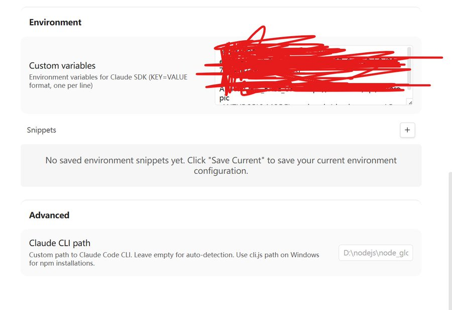

Obisidian里其实还藏着一个神级AI插件——Claudian！😚

Claudian就相当于把Claude Code内置到了Obsidian里面，比我之前这篇文章介绍的copilot办法还要优越。因为Claudian除了看到当前的文章，还能搜索到以前写过的文章，甚至能调用你其他盘储存的文章！

这就意味着你最后让AI给的改写文章的建议或者直接让AI改文章，都会更加地符合你的输出意图。甚至你能让Claudian调用API配图，效率拉满了！🤗

里面啥AI都能接，不管是GLM官方还是ZenMux订阅套餐，接入都还是蛮简单的。

只不过Claudian暂时还没上官方商店，配置有点点麻烦，但是别担心，我手把手来教你。
1.打开[https://github.com/YishenTu/claudian/releases/tag/1.3.63](https://t.co/vhTBuFmYbo)

这个仓库，把Assets的前三个文件下载下来

2.然后新建一个叫做“Claudian”的文件夹，把这三个文件放进去。
3.然后把整个文件夹移动到 .obsidian/plugins/ 文件夹中。

4.插件配置最复杂了，先打开第三方插件，找到claudian插件

5.其实截图让AI帮你根据你具体的API来填就行了，我这里充了Zenmux的套餐，所以我就以Zenmux的配置为例

6.找到custom variables，然后填入“ ANTHROPIC_API_KEY=你的API KEY ANTHROPIC_BASE_URL=[https://zenmux.ai/api/anthropic](https://t.co/HUEWCKBAZH)

ANTHROPIC_MODEL=anthropic/claude-sonnet-4.5”
7.然后退出重启一下obsidian，就会发下做侧边栏多了一个机器人脑袋图标，点一下右侧的对话框出来就能够畅玩了！

8.其实以上步骤都可以浓缩为一步，让AI“[https://github.com/YishenTu/claudian/releases/tag/1.3.63](https://t.co/vhTBuFmYbo)

教我配置claudian插件，保姆级指导”，五分钟就完成了