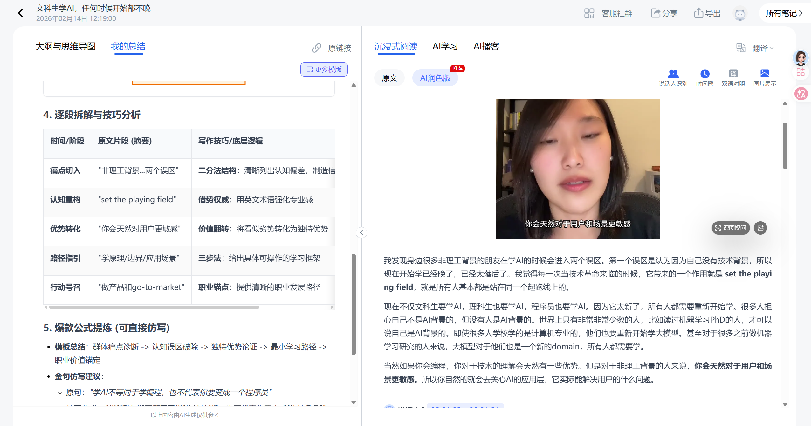
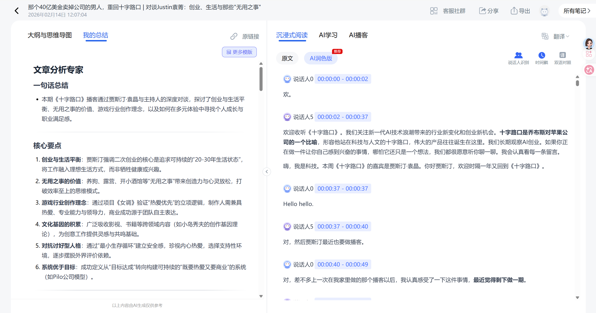
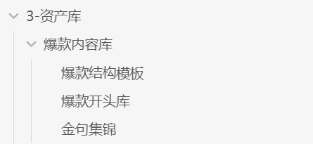

夯爆了！我找到了一个巨牛逼的能解析小红书、小宇宙和B站音视频的工具！

最近打算真人出镜做小红书AI自媒体，一直在死磕研究张咋啦老师的账号。

但你懂的，小红书反爬虫机制真的变态，所以我只能慢慢看视频学习，但是这种感觉太虚了，完全没法确定性拆解。

直到我发现了**Ai好记**这个神器。直接把小红书链接一丢，就自动批量解析钩子、脚本、爆款公式，还带截图的那种！

而且B站和小宇宙播客也能解析！举个例子，我平时比较爱听"十字路口"和"平民创业手册"，但每期太长了，而且不是每期都是干货。现在先解析一遍，1分钟就知道这期值不值得深听，直接省了几个小时！

其实最让我兴奋的一点是——如果只看视频，知识就从左脑进右脑出了。但现在配合这工具的爆款拆解+Claude Code，把爆款结构、钩子模版直接沉淀进我的Obsidian资产库，选题有了、爆款模版和金句也有了，做到了真正的复利！

Ai好记才是AI时代做国内自媒体的正确姿势！我已经用了一段时间了，顺便搞了几个月会员邀请码，有需要的朋友可以dm我！

