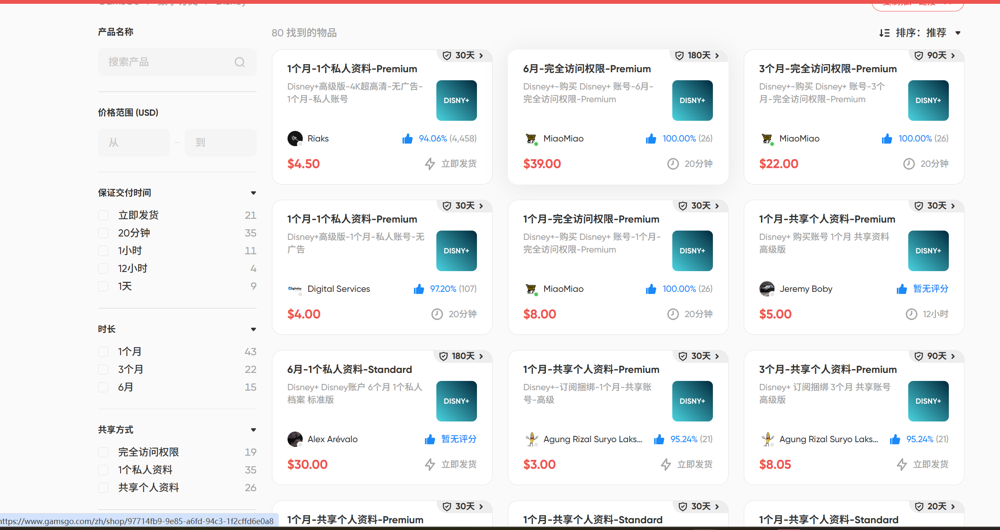

很多人不订阅Gemini，可能是不知道一个官方定价20美元的pro会员到底能享受到多少隐藏福利！

Gemini pro会员不仅仅是在App内部能够使用Veo3.1、Nano Banana pro、Deep Reasearch，其实谷歌大善人还在五个地方偷偷送福利：（赶紧mark，错过损失一个亿）

1.Flow（所有工具网址都放下面）：别的地方要花几毛钱一张的Nano Banana Pro和几块钱一个的Veo3.1，在这里，pro会员每天生成大几百张无水印图片，每个月100个无水印veo3.1，ultra会员几乎无限图片，每个月4500个veo3.1。速度超快，pro会员支持1K、2K，ultra会员还支持4K，对于高质量图片和视频有大量需求的玩家真的是宝藏！

2.NotebookLM：大家应该都不陌生，X上众多大佬推荐的学习以及原创虚拟资料的不二法宝。Pro会员能创建高达500个笔记本，每个笔记本源文件数量最高300个（再也不用担心知识库装不下自己的海量资料了），单日查询次数500次。

3.Antigravity：这个估计被很多人都玩过了，gemini 3 pro、Nanobanana pro、claude opus4.5都可以在里面调用进行编程，还配有Agent控制台。Pro会员享受5h刷新token机制，确实比普通用户更能畅快地vibe coding，反代到opencode也是很秒的【舔嘴】。

4.云资源补贴：pro会员每个月领取10 $Google Cloud积分，ultra会员每个月领取100 $积分，然后在Google ai studio里面调用API创建小项目、生图和生视频绰绰有余了~

5.生态绑定的福利：YouTube Premium优惠——订阅 AI Pro 的用户在购买 YouTube Premium 个人版时可享受约 **14%** 的折扣；**Google Store 返现**——在美国、英国等地区，购买 Pixel 手机或其他谷歌硬件可获得 **10%** 的商店信用返还；Gemini in Chrome插件的更高额度享用，丝滑接入工作流。

但是我个人觉得虽然福利多，能省还是要省，20美刀每个月还是一笔不小的支出。所以，在上次我的Google会员被回收后，就推荐了GamsGo这个“海外版咸鱼平台，里面的Gemini会员，普遍用一个月的官方价格就能买一年的会员，非常划算（有直充自己账号、合规的家庭组共享、成品号）。而且平台做了7年了，客服响应很快，中文友好支持，售后保障无忧。上面提到的YouTube premium在这个平台也卖的十分划算。

如果想过瘾，体验一把功能更丰富的Gemini Ultra会员（独有的Deep Think模式、更高赠金和各种额度），GamsGo里面的ultra会员也是砍到了白菜价。。。20刀一个月。

不仅如此，最近还有X上很多大佬在上面订阅了Disney+、Netflix等账号。就是因为实在是太划算了，跟官方比起来便宜太多！

就连封号最严重的Claude，原价200刀的Max套餐，被砍了20刀，还包质保。。。

所以，这个平台，即使现在用不到，将来也一定会用到，赶紧mark！！！