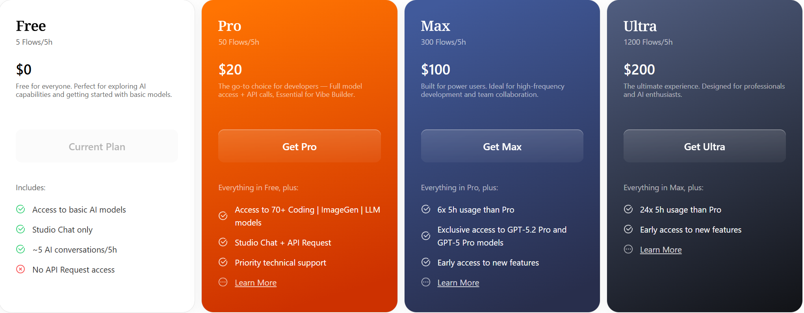

终于在我的Claude Code里面用上正版的claude opus4.6了！实测，编程的质量和速度都非常棒，我三个小时就完成了我的App新版本的迭代！

之前因为A某封控的原因，我一直用的是国产大模型中转，从来没有体验过在Claude Code里面使用Claude的爽感。但是今天，我终于发现了永不封号的正确使用方式——ZenMux。

Zenmux在Claude Opus4.6出来之后第一个在全网就接入了，速度相当快。而且ZenMux提供了订阅制和按API计费两种模式。对我这种等级的vibe coder，平时就做做小产品，订阅制真的非常友好——Max套餐已经足够我挥霍了，5h刷新token，一直开Claude Opus4.6都用不完，而且编程体感无限接近原生claude。如果是想尝尝鲜的小伙伴，pro套餐也是够够的~ 如果是开发大项目的大佬，也可以选择Ultra套餐或者直接选择调用API（支持高并发，而且现在有25%的购买优惠）。

但你千万不要认为ZenMux只是一个简单的Claude API中转站。它其实是一个聚合型网站，还能调用Nano Banana Pro、Kimi2.5、GLM4.7等等国内外知名大模型，且上新速度全网第一。所以，如果有写代码、生图多维需求的朋友，赶紧mark这个宝藏网站~

并且，还有个重磅福利！！！
所有用户，在这两周内都能在ZenMux官网的Chat里面免费使用Claude Opus4.6，这可能真的是独一家的大气了！
