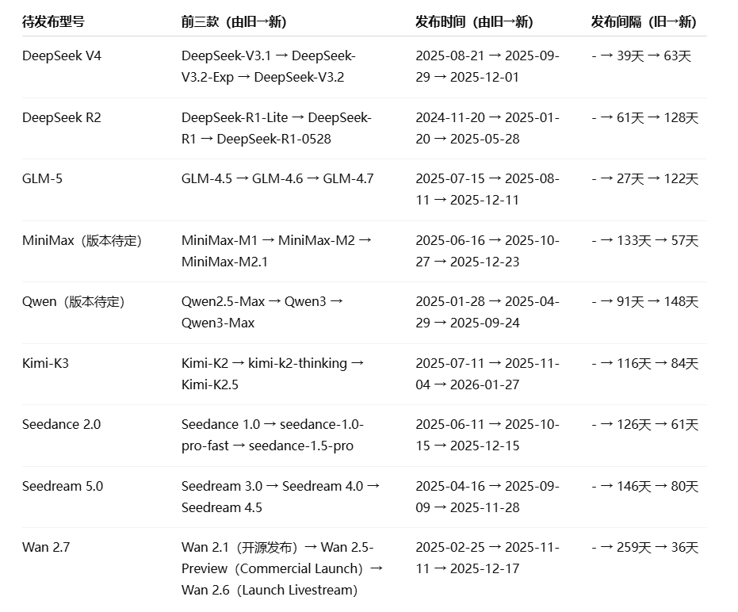

我会用绝对的数据帮大家在这场“预测大赛”中取胜，奥利给！

AI圈最近真的太卷了，claude code、opencode、openclaw...卷完这个卷那个，尽管大家都在努力地推动AI发展，但是也需要适当娱乐。这不，国产AI界的Polymarket来了！——快手万擎让大家在春节即将到来之际，一起参与到预测大模型发布中来，这绝对是AI界最近最好玩的活动！

大家一起来瓜分包括kimi、seedance、seedream、minimax、GLM等九大模型的千亿token奖池啊~，写代码、生图、生视频再也不愁，就算猜错了，也有大幅优惠券赠送。

为了在这场趣味活动中取胜，我特意搜索了这几款模型的前三个版本的发布时间和发布间隔并整理成了表格，大家可以参考着进行预测，每个人登录就有一次预测机会，转发给朋友还能获得九次~

活动传送门准备好咯，开始预测狂欢吧：https://www.streamlake.com/marketing/cny-model-guess?source=X